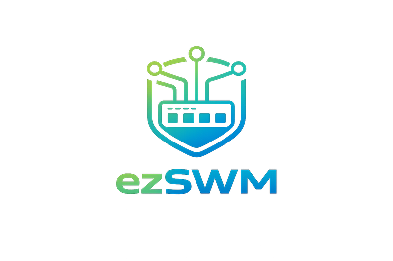

<div align="center">
  

  [](https://github.com/slgfire/ezswm/releases)
  [](LICENSE)
  [](https://nodejs.org)
  [](https://nuxt.com)
  [](compose.yaml)
  [](https://claude.ai/claude-code)

  **Document your switches, VLANs, and IPs — visually. No database required.**

  [Documentation](https://slgfire.github.io/ezswm/) | [Installation](https://slgfire.github.io/ezswm/guide/installation) | [User Guide](https://slgfire.github.io/ezswm/guide/user-guide) | [API Reference](https://slgfire.github.io/ezswm/api/reference)

</div>

---

## About

ezSWM (easy Switch Management) is an open-source, web-based infrastructure documentation tool designed for LAN parties, homelab setups, and small-to-medium network environments. It provides a visual, intuitive way to document your switch infrastructure — ports, VLANs, IP allocations, and connections — without the overhead of a traditional IPAM/DCIM solution.

All data is stored as flat JSON files. No database setup, no migrations, no external dependencies. Just Docker and go.

> This project was built with significant assistance from [Claude Code](https://claude.ai/claude-code) (Anthropic's AI coding assistant). Architecture decisions, code implementation, and iterative refinement were done collaboratively between human and AI.

---

## Quick Start

```bash
docker pull ghcr.io/slgfire/ezswm:latest
docker run -d -p 3000:3000 -e JWT_SECRET=$(openssl rand -hex 32) -v ezswm-data:/app/data ghcr.io/slgfire/ezswm:latest
```

Open http://localhost:3000 — follow the setup wizard to create your admin account.

<details>
<summary>More installation options</summary>

### Docker Compose (from source)

```bash
git clone https://github.com/slgfire/ezswm.git
cd ezswm
export JWT_SECRET=$(openssl rand -hex 32)
docker compose up -d
```

### Local Development

```bash
git clone https://github.com/slgfire/ezswm.git
cd ezswm
npm install
npm run dev
```

### Demo Data

```bash
./scripts/seed-demo.sh
```

</details>

---

## Tech Stack

| Layer | Technology |
|-------|-----------|
| Framework | [Nuxt 4](https://nuxt.com) + TypeScript (strict) |
| UI | [Nuxt UI v4](https://ui.nuxt.com) + Tailwind CSS v4 |
| Validation | Zod (server) + UForm (client) |
| Auth | JWT + bcrypt |
| Storage | Atomic JSON file writes |
| Container | Docker multi-stage (node:22-alpine) |
| CI | GitHub Actions (auto Docker image build) |
| i18n | Nuxt i18n (EN/DE) |

---

## Roadmap

- **Rack Planning** — Visual 19" rack view with height-unit positioning
- **Topology** — Interactive network topology diagram
- **LAG Groups** — Link Aggregation Group management
- **IPv6 Support** — IPv6 subnet and allocation tracking
- **Print View** — Printable switch front panel layouts

---

## Contributing

Contributions are welcome! Please open an issue first to discuss what you'd like to change.

## License

[GNU General Public License v3.0](LICENSE)
