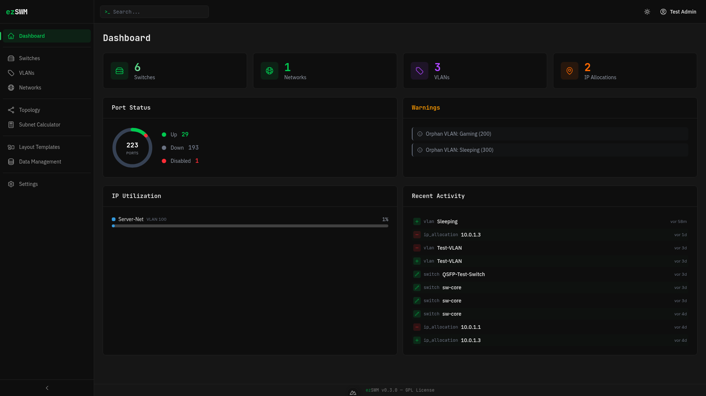
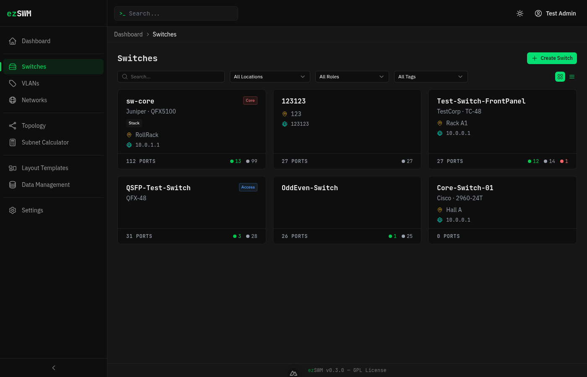
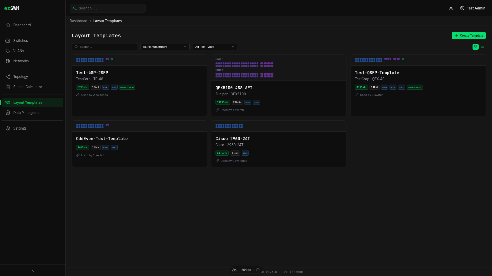
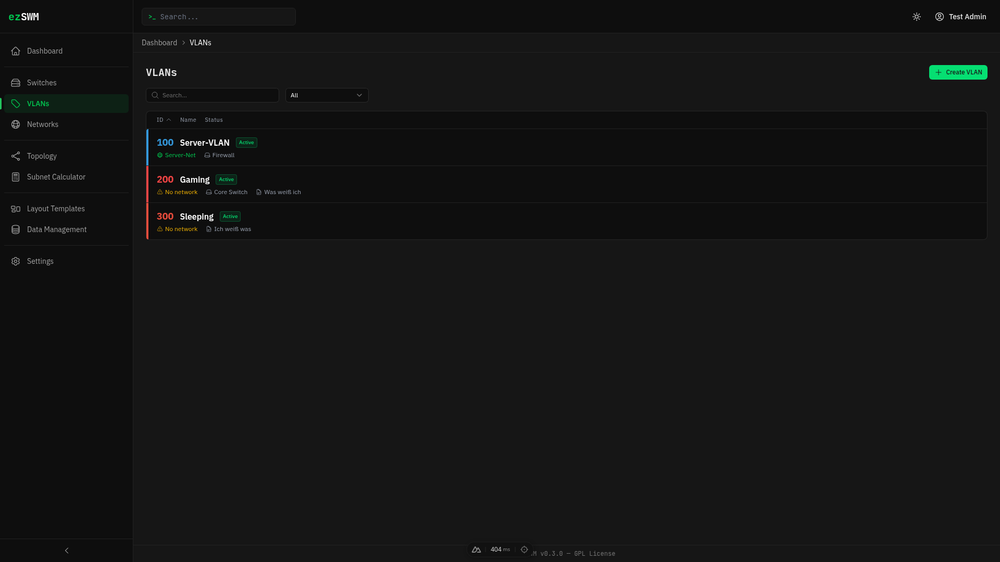
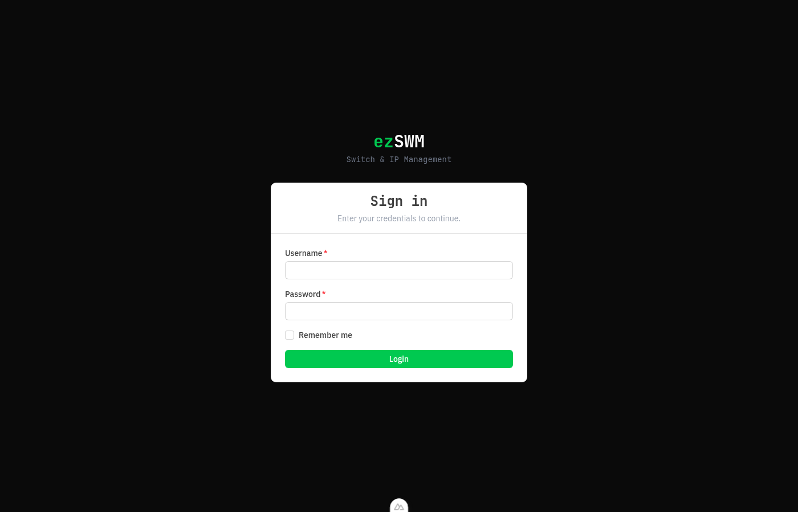

<div align="center">
  

  [](https://github.com/slgfire/ezswm/releases)
  [](LICENSE)
  [](https://nodejs.org)
  [](https://nuxt.com)
  [](compose.yaml)
  [](https://claude.ai/claude-code)

  **Document your switches, VLANs, and IPs — visually. No database required.**

</div>

---

## About

ezSWM (easy Switch Management) is an open-source, web-based infrastructure documentation tool designed for LAN parties, homelab setups, and small-to-medium network environments. It provides a visual, intuitive way to document your switch infrastructure — ports, VLANs, IP allocations, and connections — without the overhead of a traditional IPAM/DCIM solution.

All data is stored as flat JSON files. No database setup, no migrations, no external dependencies. Just Docker and go.

> This project was built with significant assistance from [Claude Code](https://claude.ai/claude-code) (Anthropic's AI coding assistant). Architecture decisions, code implementation, and iterative refinement were done collaboratively between human and AI.

---

## Screenshots

<div align="center">
  
  <p><em>Dashboard — KPIs, port status, IP utilization, warnings, activity feed</em></p>
</div>

<div align="center">

| Switches | Layout Templates |
|:---:|:---:|
|  |  |

| VLANs | Login |
|:---:|:---:|
|  |  |

</div>

---

## Features

### Switch & Port Management

> Visual front-panel rendering with full port documentation

- See your ports as they look on the real switch, color-coded by VLAN
- Click any port to configure VLANs, speed, connected devices, and descriptions
- Link ports to other switches with **bidirectional sync** — speed, VLANs, and status are mirrored automatically
- Conflict detection warns when a target port is already connected
- Self-switch connections for stacked/multi-unit setups
- One-click port reset that cleanly removes bidirectional links

### Layout Templates

> Define switch models once, reuse everywhere

- Support for RJ45, SFP+, QSFP, Management, and Console port types
- Row layout modes: sequential, odd/even, or even/odd numbering
- Smart labels: `xe-0/0/` auto-generates as `xe-0/0/1`, `xe-0/0/2`, ...
- Default speed per block, overridable per port
- Live label sync — template changes propagate to all linked switches instantly

### VLAN & Network Management

> Color-coded VLANs, subnet tracking, IP allocation

- VLAN management with unique color assignments across your infrastructure
- Subnet management with IP allocation and range tracking
- Built-in IPv4 subnet calculator
- Ports show VLAN color tinting and trunk indicators (yellow stripe)

### Search, Export & Administration

> Everything you need to manage your documentation

- Global search across switches, VLANs, networks, IPs, and templates
- Export/import per entity, full backup/restore
- Client-side form validation on all create/edit forms
- Dark mode (deep industrial theme) + light mode
- i18n: English and German
- JSON file storage — no database, no migrations
- Docker-ready with CI/CD image builds

---

## Quick Start

### Docker (recommended)

```bash
git clone https://github.com/slgfire/ezswm.git
cd ezswm
export JWT_SECRET=$(openssl rand -hex 32)
docker compose up -d
```

Open http://localhost:3000 — follow the setup wizard to create your admin account.

### Demo Data

Populate with realistic demo data (switches, VLANs, networks, templates):

```bash
./scripts/seed-demo.sh
```

### Docker Pull (from GitHub Container Registry)

```bash
docker pull ghcr.io/slgfire/ezswm:latest
docker run -d -p 3000:3000 -e JWT_SECRET=$(openssl rand -hex 32) -v ezswm-data:/app/data ghcr.io/slgfire/ezswm:latest
```

### Local Development

```bash
npm install
npm run dev
```

Open http://localhost:3000

---

## Configuration

| Variable | Required | Default | Description |
|----------|----------|---------|-------------|
| `JWT_SECRET` | **Yes** | — | Secret for JWT token signing |
| `PORT` | No | `3000` | HTTP port |
| `DATA_DIR` | No | `/app/data` | JSON data storage path |

In Docker, use `NUXT_JWT_SECRET` and `NUXT_DATA_DIR` (Nuxt runtime config prefix).

---

## Tech Stack

| Layer | Technology |
|-------|-----------|
| Framework | [Nuxt 4](https://nuxt.com) + TypeScript (strict) |
| UI | [Nuxt UI v4](https://ui.nuxt.com) + Tailwind CSS v4 |
| Validation | Zod (server) + UForm (client) |
| Auth | JWT + bcrypt |
| Storage | Atomic JSON file writes |
| Container | Docker multi-stage (node:22-alpine) |
| CI | GitHub Actions (auto Docker image build) |
| i18n | Nuxt i18n (EN/DE) |

---

## Architecture

```
app/                  # Frontend (pages, components, composables)
server/
  api/                # API routes (~70 endpoints)
  repositories/       # Data access (JSON storage)
  validators/         # Zod schemas
  storage/            # Atomic JSON read/write
types/                # Shared TypeScript interfaces
i18n/locales/         # Translation files (EN, DE)
data/                 # Runtime JSON data (gitignored)
```

All data lives in `data/` as JSON files. Storage writes are atomic
(write to temp file, then rename) to prevent corruption.

---

## Port Visualization

Ports render based on **Layout Templates** — reusable switch model
definitions with configurable blocks:

| Port Type | Visual |
|-----------|--------|
| RJ45 | Square, standard size |
| SFP / SFP+ | Taller, rounded top, "SFP+" label |
| QSFP | Wide, rounded top, "QSFP" label |
| Management | Teal border |
| Console | Amber border |

Each block supports:
- **Row layout** modes: sequential, odd/even, even/odd
- **Default speed**: applied to all ports in the block
- **Smart labels**: trailing separators (`/`, `-`, `:`, `.`) append index directly

Ports are color-tinted by their native VLAN color and show trunk
indicators (yellow stripe) when tagged VLANs are assigned.

---

## Connected Device Linking

Ports support two connection modes:

- **Freetext** — Type any device name and port
- **Switch Reference** — Select a switch and port from dropdowns, creating a bidirectional link

When linking via switch reference:
- Remote port gets the reverse link automatically
- Speed, VLANs, and status are synced to the remote side
- Changing the connection removes the old link cleanly
- Self-switch connections supported (for stacked switches)
- Conflict warning shown if the target port is already connected

---

## Roadmap

- **Sites / Locations** — Isolated sites with separate switches, VLANs, and networks per location (e.g. LAN party + data center)
- **Rack Planning** — Visual 19" rack view with height-unit positioning for switches and devices
- **Topology** — Interactive network topology diagram showing switch-to-switch connections
- **LAG Groups** — Link Aggregation Group management with visual port indicators
- **IPv6 Support** — IPv6 subnet and allocation tracking
- **Print View** — Printable switch front panel layouts

---

## Contributing

Contributions are welcome! Please open an issue first to discuss what you'd like to change.

---

## License

[GNU General Public License v3.0](LICENSE)
