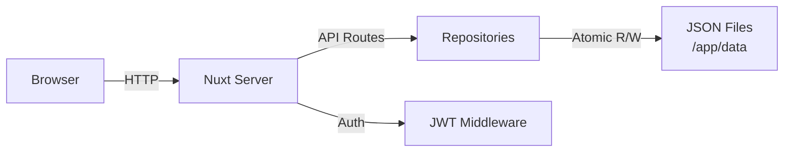

# User Guide

## Getting Started

### First Login

When you launch ezSWM for the first time, a setup wizard guides you through creating an admin account. Enter a username, display name, and password. After setup, you are redirected to the login screen.

### Dashboard Overview

After logging in, the dashboard provides a summary of your infrastructure: total switches, VLANs, networks, and IP utilization. The sidebar on the left gives access to all sections. The header bar contains global search, a theme toggle (dark/light), language selector, and user menu.

## Layout Templates

### What They Are

Layout templates define reusable switch model definitions. Instead of manually configuring port layouts for every switch, you create a template once (e.g., "Cisco C9300-48P") and assign it to any number of switches. The template determines how many ports appear, their types, and how they are visually arranged.

### How to Create One

Navigate to **Layout Templates** in the sidebar and click **Create**.

**Basic fields:**

- **Name** (required) -- a descriptive name, e.g., "UniFi USW-48-PoE"
- **Manufacturer** -- e.g., "Ubiquiti"
- **Model** -- e.g., "USW-48-PoE"
- **Description** -- optional notes

**Units:**

A template has one or more units (rack units). Each unit contains one or more port blocks. Click **Add Unit** to add additional units for stackable or multi-unit switches.

**Port blocks:**

Each block defines a group of ports within a unit:

- **Type** -- RJ45, SFP, SFP+, QSFP, Console, or Management
- **Count** -- number of ports in this block
- **Start Index** -- the first port number (default 1)
- **Rows** -- how many rows to render (1 for single-row, 2 for dual-row like most 48-port switches)
- **Row Layout** -- how ports are distributed across rows:
  - **Sequential** -- fills top row first, then bottom row
  - **Odd/Even** -- odd-numbered ports on top, even on bottom
  - **Even/Odd** -- even-numbered ports on top, odd on bottom
- **Default Speed** -- 100M, 1G, 2.5G, 10G, or 100G
- **Label** -- optional prefix for port labels

### Smart Labels

If the block label ends with a separator character (`/`, `-`, `:`, or `.`), the port index is appended directly. For example, a label of `Gi1/0/` produces ports `Gi1/0/1`, `Gi1/0/2`, etc. Without a trailing separator, the label is combined with the unit and port index like `Label 1/1`.

### Live Preview

As you configure units and blocks, a live port grid preview renders at the bottom of the form so you can verify the layout before saving.

## Switches

### Creating a Switch

Navigate to **Switches** in the sidebar and click **Create**.

Fields:

- **Name** (required) -- e.g., "Core-SW-01"
- **Model** -- hardware model
- **Manufacturer** -- hardware vendor
- **Serial Number** -- for inventory tracking
- **Location** -- physical location, e.g., "Server Room A, Rack 3"
- **Rack Position** -- position within the rack
- **Management IP** -- must be a valid IPv4 address
- **Firmware Version** -- currently running firmware
- **Layout Template** -- select a previously created template; this generates the port grid
- **Role** -- Core, Distribution, Access, or Management
- **Tags** -- freeform tags; type and press Enter to add, click a tag to remove
- **Notes** -- freetext

### Port Visualization

On a switch detail page, ports are rendered as a visual grid matching the layout template. Ports are color-coded by their assigned VLAN. Trunk ports (carrying multiple VLANs) display a striped indicator. Unassigned ports appear in a neutral color.

### Editing Ports

Click any port in the grid to open a slideover panel. From there you can configure:

- **Native VLAN** -- the untagged VLAN for this port
- **Tagged VLANs** -- additional VLANs carried on a trunk
- **Speed** -- override the default speed
- **Status** -- up, down, or disabled
- **Connected Device** -- what is plugged into this port (see below)
- **Description** -- port-level notes

### Bulk Port Editing

Select multiple ports by holding Shift or Ctrl and clicking, then use the bulk edit action to apply the same VLAN, speed, or status to all selected ports at once.

### Connected Device Linking

Each port can track what is connected to it. Two modes are available:

- **Freetext** -- type a device name manually (e.g., "AP-Floor2-West")
- **Switch Reference** -- link to another switch and port in ezSWM; this creates a bidirectional connection that stays in sync when either end is updated

### Drag & Drop Sort Order

On the switch list page, you can drag switches to reorder them. The sort order is persisted and reflected across all views.

## VLANs

### Creating VLANs

Navigate to **VLANs** in the sidebar and click **Create**.

Fields:

- **VLAN ID** (required) -- integer from 1 to 4094
- **Name** (required) -- descriptive name, e.g., "Guest WiFi"
- **Description** -- optional
- **Status** -- Active or Inactive
- **Routing Device** -- which router/L3 switch handles this VLAN
- **Color** (required) -- hex color code; a unique color is auto-suggested to avoid duplicates

### Color System

Each VLAN has a unique color that appears on port visualizations across all switches. This makes it easy to visually identify which VLAN a port belongs to. The color picker includes both a visual selector and a hex input field.

### Editing and Deleting

Click a VLAN in the list to view its details. From there you can edit all fields or delete the VLAN. The detail view also shows which switch ports are currently assigned to this VLAN.

## Networks & IP Management

### Creating Networks

Navigate to **Networks** in the sidebar and click **Create**.

Fields:

- **Name** (required) -- e.g., "Server LAN"
- **Subnet** (required) -- CIDR notation, e.g., `10.0.1.0/24`
- **Gateway** -- e.g., `10.0.1.1`
- **DNS Servers** -- comma-separated list, e.g., `8.8.8.8, 8.8.4.4`
- **VLAN** -- associate this network with a VLAN from the dropdown
- **Description** -- optional

### IP Allocations

On a network detail page, you can allocate individual IP addresses within the subnet. Each allocation records the IP address, hostname, MAC address, and a description. This serves as your IP address management (IPAM) registry.

### IP Ranges

Within a network, you can define IP ranges to designate blocks of addresses for specific purposes:

- **DHCP** -- addresses handed out dynamically
- **Static** -- addresses assigned manually
- **Reserved** -- addresses set aside (e.g., for future use or infrastructure)

Each range has a start IP, end IP, name, and type.

### Utilization Tracking

The network detail page displays utilization metrics: total addresses in the subnet, how many are allocated, and how many fall within defined ranges. A visual bar shows overall usage at a glance.

## Global Search

Press **Ctrl+K** (or click the search icon in the header) to open global search. It searches across:

- Switches (by name, location, management IP, model, manufacturer, tags)
- VLANs (by name, VLAN ID)
- Networks (by name, subnet)
- IP allocations (by IP, hostname)
- Layout templates (by name)

Use arrow keys to navigate results and Enter to jump to the selected item.

## Data Management

### Export and Import

Each entity type (switches, VLANs, networks, layout templates) can be individually exported to JSON and imported back. This is useful for transferring specific data between instances.

### Full Backup and Restore

The **Data Management** section in settings provides full backup and restore. A backup produces a single JSON file containing all entities. Restore replaces all data with the contents of a backup file.

### Backup Format

Backups are plain JSON files. They can be version-controlled, diffed, or edited manually if needed.

## Settings

### General Settings

Access settings via the user menu in the header or the sidebar. General settings cover application-level configuration.

### Account Settings

Change your display name and preferred language (English or German).

### Password Change

Change your password from the account settings page. You must provide your current password and confirm the new one.

## Architecture Overview

The following diagram shows how requests flow through ezSWM:

