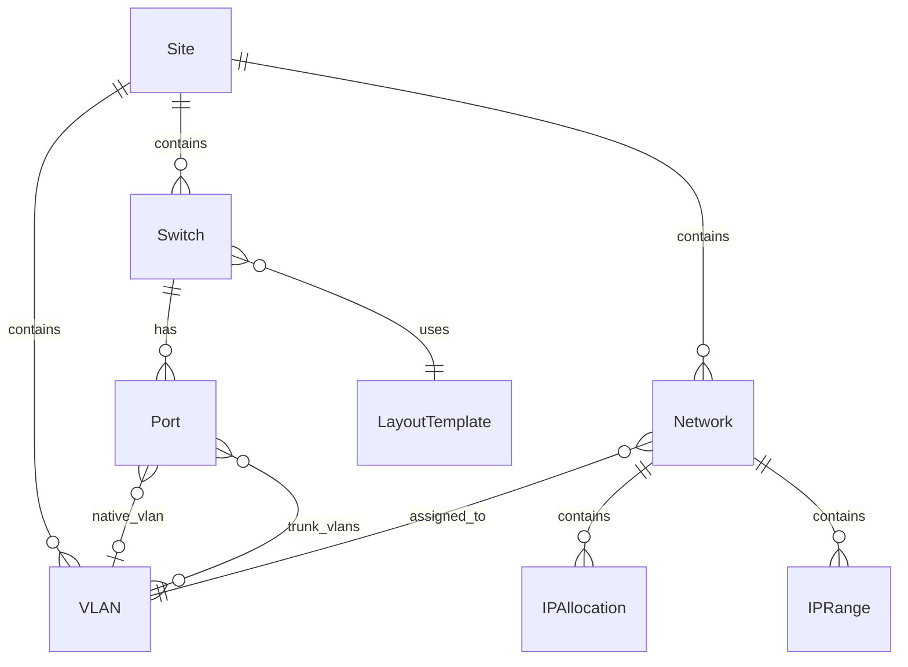

# API Reference

All endpoints require authentication via JWT cookie except `/api/health`, `/api/auth/login`, and `/api/auth/setup`.

## Data Model

---

## Authentication

| Method | Endpoint | Description |
|--------|----------|-------------|
| POST | `/api/auth/login` | Log in and receive JWT cookie |
| POST | `/api/auth/logout` | Log out and clear JWT cookie |
| GET | `/api/auth/me` | Get current authenticated user |
| POST | `/api/auth/setup` | Initial admin account setup |

## Switches

| Method | Endpoint | Description |
|--------|----------|-------------|
| GET | `/api/switches` | List all switches |
| POST | `/api/switches` | Create a new switch |
| GET | `/api/switches/:id` | Get switch by ID |
| PUT | `/api/switches/:id` | Update switch by ID |
| DELETE | `/api/switches/:id` | Delete switch by ID |
| POST | `/api/switches/:id/duplicate` | Duplicate a switch |
| PUT | `/api/switches/sort` | Update switch sort order |

## Switch Ports

| Method | Endpoint | Description |
|--------|----------|-------------|
| PUT | `/api/switches/:id/ports/:portId` | Update a switch port |
| DELETE | `/api/switches/:id/ports/:portId` | Delete a switch port |
| PUT | `/api/switches/:id/ports/bulk` | Bulk update switch ports |

## Switch LAG Groups

| Method | Endpoint | Description |
|--------|----------|-------------|
| GET | `/api/switches/:id/lag-groups` | List LAG groups for a switch |
| POST | `/api/switches/:id/lag-groups` | Create a LAG group |
| GET | `/api/switches/:id/lag-groups/:id` | Get LAG group by ID |
| PUT | `/api/switches/:id/lag-groups/:id` | Update LAG group by ID |
| DELETE | `/api/switches/:id/lag-groups/:id` | Delete LAG group by ID |

## VLANs

| Method | Endpoint | Description |
|--------|----------|-------------|
| GET | `/api/vlans` | List all VLANs |
| POST | `/api/vlans` | Create a new VLAN |
| GET | `/api/vlans/:id` | Get VLAN by ID |
| PUT | `/api/vlans/:id` | Update VLAN by ID |
| DELETE | `/api/vlans/:id` | Delete VLAN by ID |
| GET | `/api/vlans/:id/references` | Get objects referencing this VLAN |
| GET | `/api/vlans/suggest-color` | Suggest a color for a new VLAN |

## Networks

| Method | Endpoint | Description |
|--------|----------|-------------|
| GET | `/api/networks` | List all networks |
| POST | `/api/networks` | Create a new network |
| GET | `/api/networks/:id` | Get network by ID |
| PUT | `/api/networks/:id` | Update network by ID |
| DELETE | `/api/networks/:id` | Delete network by ID |
| GET | `/api/networks/:id/references` | Get objects referencing this network |
| GET | `/api/networks/:id/utilization` | Get network IP utilization stats |

## Network IP Allocations

| Method | Endpoint | Description |
|--------|----------|-------------|
| GET | `/api/networks/:id/allocations` | List allocations for a network |
| POST | `/api/networks/:id/allocations` | Create an IP allocation |
| GET | `/api/networks/:id/allocations/:allocId` | Get allocation by ID |
| PUT | `/api/networks/:id/allocations/:allocId` | Update allocation by ID |
| DELETE | `/api/networks/:id/allocations/:allocId` | Delete allocation by ID |

## Network IP Ranges

| Method | Endpoint | Description |
|--------|----------|-------------|
| GET | `/api/networks/:id/ranges` | List IP ranges for a network |
| POST | `/api/networks/:id/ranges` | Create an IP range |
| GET | `/api/networks/:id/ranges/:rangeId` | Get IP range by ID |
| PUT | `/api/networks/:id/ranges/:rangeId` | Update IP range by ID |
| DELETE | `/api/networks/:id/ranges/:rangeId` | Delete IP range by ID |

## Layout Templates

| Method | Endpoint | Description |
|--------|----------|-------------|
| GET | `/api/layout-templates` | List all layout templates |
| POST | `/api/layout-templates` | Create a layout template |
| GET | `/api/layout-templates/:id` | Get layout template by ID |
| PUT | `/api/layout-templates/:id` | Update layout template by ID |
| DELETE | `/api/layout-templates/:id` | Delete layout template by ID |
| POST | `/api/layout-templates/:id/duplicate` | Duplicate a layout template |
| GET | `/api/layout-templates/:id/export` | Export a layout template as file |
| POST | `/api/layout-templates/import` | Import a layout template from file |

## Users

| Method | Endpoint | Description |
|--------|----------|-------------|
| GET | `/api/users` | List all users |
| POST | `/api/users` | Create a new user |
| GET | `/api/users/:id` | Get user by ID |
| PUT | `/api/users/:id` | Update user by ID |
| DELETE | `/api/users/:id` | Delete user by ID |
| PUT | `/api/users/:id/password` | Change user password |

## Settings

| Method | Endpoint | Description |
|--------|----------|-------------|
| GET | `/api/settings` | Get application settings |
| PUT | `/api/settings` | Update application settings |

## Dashboard & Tools

| Method | Endpoint | Description |
|--------|----------|-------------|
| GET | `/api/health` | Health check endpoint (no auth) |
| GET | `/api/dashboard/stats` | Get dashboard statistics |
| GET | `/api/search` | Global search across all entities |
| GET | `/api/subnet-calculator` | Calculate subnet details from CIDR |

### Topology

| Method | Endpoint | Description |
|--------|----------|-------------|
| GET | `/api/sites/:siteId/topology` | Get topology data (nodes, links, ghost nodes) for a site |
| GET | `/api/sites/:siteId/topology-layout` | Get saved node positions for a site |
| PUT | `/api/sites/:siteId/topology-layout` | Save node positions |
| DELETE | `/api/sites/:siteId/topology-layout` | Reset saved layout |

## Data Management

| Method | Endpoint | Description |
|--------|----------|-------------|
| GET | `/api/backup/export` | Export full backup as archive |
| POST | `/api/backup/import` | Import full backup from archive |
| GET | `/api/data/export` | Export all data as JSON |
| POST | `/api/data/import` | Import all data from JSON |
| GET | `/api/data/template` | Download blank data template |
| GET | `/api/export/:entity` | Export a single entity type as CSV |
| POST | `/api/import/:entity` | Import a single entity type from CSV |
| GET | `/api/import/template/:entity` | Download CSV template for entity |

## Activity

| Method | Endpoint | Description |
|--------|----------|-------------|
| GET | `/api/activity` | List recent activity log entries |
| POST | `/api/activity/:id/undo` | Undo an activity log entry |
