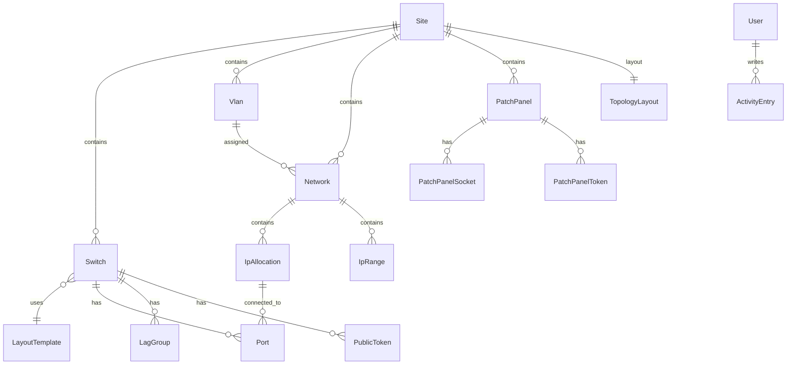

# API Reference

## Authentication and public exceptions

By default, `/api/**` requires a valid JWT cookie.

Public exceptions in `server/middleware/auth.ts`:

- `POST /api/auth/setup`
- `POST /api/auth/login`
- `POST /api/auth/logout`
- `GET /api/health`
- `GET /api/setup/status`
- `GET /api/changelog`
- `GET /api/version-latest`
- `GET /api/settings` (special-case exception)
- `GET /api/p/:token` (public switch view)
- `GET /api/p/pp/:token` (public patch-panel view; only available while Patch Panels are enabled)

---

## Data model (current)


```mermaid
erDiagram
    Site ||--o{ Switch : contains
    Site ||--o{ Vlan : contains
    Site ||--o{ Network : contains
    Site ||--o{ PatchPanel : contains

    Switch }o--|| LayoutTemplate : uses
    Switch ||--o{ Port : has
    Switch ||--o{ LagGroup : has
    Switch ||--o{ PublicToken : has

    PatchPanel ||--o{ PatchPanelSocket : has
    PatchPanel ||--o{ PatchPanelToken : has

    Vlan ||--o{ Network : assigned
    Network ||--o{ IpAllocation : contains
    Network ||--o{ IpRange : contains
    IpAllocation ||--o{ Port : connected_to

    Site ||--|| TopologyLayout : layout
    User ||--o{ ActivityEntry : writes
```

---

## Authentication

| Method | Endpoint | Description |
|--------|----------|-------------|
| POST | `/api/auth/login` | Log in and set JWT cookie (public) |
| POST | `/api/auth/logout` | Log out and clear JWT cookie (public) |
| GET | `/api/auth/me` | Get current authenticated user |
| POST | `/api/auth/setup` | Initial admin account setup (public until completed) |

## Setup & system

| Method | Endpoint | Description |
|--------|----------|-------------|
| GET | `/api/setup/status` | Setup/site-initialization status for setup wizard (public) |
| POST | `/api/setup/initial-site` | Create first site (requires auth; blocked after initialization) |
| GET | `/api/health` | Health check (public) |
| GET | `/api/changelog` | Read changelog entries by locale (public) |
| GET | `/api/version-latest` | Fetch latest GitHub release tag (public) |

## Settings

| Method | Endpoint | Description |
|--------|----------|-------------|
| GET | `/api/settings` | Get app settings (public middleware exception) |
| PUT | `/api/settings` | Update app settings |

## Sites

| Method | Endpoint | Description |
|--------|----------|-------------|
| GET | `/api/sites` | List sites (`search` query supported) |
| POST | `/api/sites` | Create site |
| GET | `/api/sites/:id` | Get site by id/slug |
| PUT | `/api/sites/:id` | Update site by id/slug |
| DELETE | `/api/sites/:id` | Delete site (cascades site-scoped entities) |

## Switches

| Method | Endpoint | Description |
|--------|----------|-------------|
| GET | `/api/switches` | List switches (`site_id` filter supported) |
| POST | `/api/switches` | Create switch |
| GET | `/api/switches/:id` | Get switch by UUID or slug (`siteId` query for disambiguation) |
| PUT | `/api/switches/:id` | Update switch |
| DELETE | `/api/switches/:id` | Delete switch |
| POST | `/api/switches/:id/duplicate` | Duplicate switch |
| PUT | `/api/switches/sort` | Update switch sort order |

### Switch ports and configured VLANs

| Method | Endpoint | Description |
|--------|----------|-------------|
| PUT | `/api/switches/:id/ports/:portId` | Update single port |
| DELETE | `/api/switches/:id/ports/:portId` | Reset/clear single port |
| PUT | `/api/switches/:id/ports/bulk` | Bulk update selected ports |
| PUT | `/api/switches/:id/configured-vlans` | Add/remove/remove_confirmed configured VLANs |

### LAG groups

| Method | Endpoint | Description |
|--------|----------|-------------|
| GET | `/api/switches/:id/lag-groups` | List LAG groups for switch |
| POST | `/api/switches/:id/lag-groups` | Create LAG group |
| GET | `/api/switches/:id/lag-groups/:lagId` | Get LAG group |
| PUT | `/api/switches/:id/lag-groups/:lagId` | Update LAG group |
| DELETE | `/api/switches/:id/lag-groups/:lagId` | Delete LAG group |

### Switch public token lifecycle

| Method | Endpoint | Description |
|--------|----------|-------------|
| GET | `/api/switches/:id/public-token` | Get latest active token |
| POST | `/api/switches/:id/public-token` | Create new token |
| DELETE | `/api/switches/:id/public-token` | Revoke active token |

## Public switch and patch-panel routes (read-only)

| Method | Endpoint | Description |
|--------|----------|-------------|
| GET | `/api/p/:token` | Public switch payload from token |
| GET | `/api/p/pp/:token` | Public patch-panel payload from token (requires Patch Panels enabled) |

## Patch Panels (settings-gated)

All authenticated Patch Panel routes return an error when `patch_panels_enabled` is false.

| Method | Endpoint | Description |
|--------|----------|-------------|
| GET | `/api/patch-panels` | List patch panels (`site_id` filter supported) |
| POST | `/api/patch-panels` | Create patch panel (12/24/48 ports) |
| GET | `/api/patch-panels/:id` | Get patch panel by UUID or slug (`siteId` query supported) |
| PUT | `/api/patch-panels/:id` | Update patch panel metadata |
| DELETE | `/api/patch-panels/:id` | Delete patch panel |
| PUT | `/api/patch-panels/:id/sockets/:socketId` | Update one socket/port metadata |

### Patch Panel public token lifecycle

| Method | Endpoint | Description |
|--------|----------|-------------|
| GET | `/api/patch-panels/:id/public-token` | Get latest active token |
| POST | `/api/patch-panels/:id/public-token` | Create new token |
| DELETE | `/api/patch-panels/:id/public-token` | Revoke active token |

## VLANs

| Method | Endpoint | Description |
|--------|----------|-------------|
| GET | `/api/vlans` | List VLANs (`site_id` filter supported) |
| POST | `/api/vlans` | Create VLAN |
| GET | `/api/vlans/:id` | Get VLAN |
| PUT | `/api/vlans/:id` | Update VLAN |
| DELETE | `/api/vlans/:id` | Delete VLAN |
| GET | `/api/vlans/:id/references` | Get dependency references |
| GET | `/api/vlans/suggest-color` | Suggest unused VLAN color |

## Subnets (`/api/networks`)

::: tip
The UI calls this entity **Subnets**. API paths stay `/api/networks` for compatibility.
:::

| Method | Endpoint | Description |
|--------|----------|-------------|
| GET | `/api/networks` | List subnets (`site_id` filter supported) |
| POST | `/api/networks` | Create subnet |
| GET | `/api/networks/:id` | Get subnet |
| PUT | `/api/networks/:id` | Update subnet |
| DELETE | `/api/networks/:id` | Delete subnet |
| GET | `/api/networks/:id/references` | Get dependency references |
| GET | `/api/networks/:id/utilization` | Subnet utilization summary |

### IP allocations

| Method | Endpoint | Description |
|--------|----------|-------------|
| GET | `/api/networks/:id/allocations` | List allocations in subnet |
| POST | `/api/networks/:id/allocations` | Create allocation |
| GET | `/api/networks/:id/allocations/:allocId` | Get allocation |
| PUT | `/api/networks/:id/allocations/:allocId` | Update allocation |
| DELETE | `/api/networks/:id/allocations/:allocId` | Delete allocation |
| GET | `/api/networks/:id/allocations/:allocId/references` | List switch ports connected to this allocation |

### IP ranges

| Method | Endpoint | Description |
|--------|----------|-------------|
| GET | `/api/networks/:id/ranges` | List ranges in subnet |
| POST | `/api/networks/:id/ranges` | Create range |
| GET | `/api/networks/:id/ranges/:rangeId` | Get range |
| PUT | `/api/networks/:id/ranges/:rangeId` | Update range |
| DELETE | `/api/networks/:id/ranges/:rangeId` | Delete range |

### Site-scoped allocation feed

| Method | Endpoint | Description |
|--------|----------|-------------|
| GET | `/api/sites/:siteId/ip-allocations` | List enriched allocations for one site (or `siteId=all`) |

## Layout templates

| Method | Endpoint | Description |
|--------|----------|-------------|
| GET | `/api/layout-templates` | List templates |
| POST | `/api/layout-templates` | Create template |
| GET | `/api/layout-templates/:id` | Get template |
| PUT | `/api/layout-templates/:id` | Update template |
| DELETE | `/api/layout-templates/:id` | Delete template |
| POST | `/api/layout-templates/:id/duplicate` | Duplicate template |
| GET | `/api/layout-templates/:id/export` | Export one template |
| POST | `/api/layout-templates/import` | Import template payload |

## Users

| Method | Endpoint | Description |
|--------|----------|-------------|
| GET | `/api/users` | List users |
| POST | `/api/users` | Create user |
| GET | `/api/users/:id` | Get user |
| PUT | `/api/users/:id` | Update user |
| DELETE | `/api/users/:id` | Delete user |
| PUT | `/api/users/:id/password` | Change password |

## Search, dashboard, topology, tools

| Method | Endpoint | Description |
|--------|----------|-------------|
| GET | `/api/search` | Global search (switches/VLANs/subnets/allocations/ranges/templates/LAGs/patch panels) |
| GET | `/api/dashboard/stats` | Dashboard counters/utilization |
| GET | `/api/subnet-calculator` | CIDR calculation utility |
| GET | `/api/sites/:siteId/topology` | Topology graph payload |
| GET | `/api/sites/:siteId/topology-layout` | Get saved topology node positions |
| PUT | `/api/sites/:siteId/topology-layout` | Save topology node positions |
| DELETE | `/api/sites/:siteId/topology-layout` | Reset topology node positions |

## Device library

| Method | Endpoint | Description |
|--------|----------|-------------|
| GET | `/api/device-library/search` | Search NetBox device-type library via GitHub API |
| GET | `/api/device-library/device` | Fetch one NetBox YAML and convert to ezSWM template |

Both endpoints depend on internet access to GitHub and can return `503` when unavailable.

## Data management and imports/exports

| Method | Endpoint | Description |
|--------|----------|-------------|
| GET | `/api/backup/export` | Full DB JSON backup (`schema: "sqlite-v1"`) |
| POST | `/api/backup/import` | Full DB restore from backup payload |
| GET | `/api/data/export` | Alias of backup export |
| POST | `/api/data/import` | Legacy per-entity import endpoint (`{ type, data[] }`) |
| GET | `/api/data/template` | CSV header template for legacy data import |
| GET | `/api/export/:entity` | Export one entity table (`switches|vlans|networks|allocations|templates`) as JSON/CSV |
| POST | `/api/import/:entity` | Per-entity bulk import (`switches|vlans|networks|allocations|ranges|templates`) |
| GET | `/api/import/template/:entity` | JSON import template for supported entity |

### Current full-backup payload shape

`/api/backup/export` and `/api/data/export` currently include:

```json
{
  "version": "0.37.1",
  "created_at": "2026-09-04T00:00:00.000Z",
  "schema": "sqlite-v1",
  "data": {
    "sites": [...],
    "users": [...],
    "switches": [...],
    "ports": [...],
    "vlans": [...],
    "networks": [...],
    "ipAllocations": [...],
    "ipRanges": [...],
    "layoutTemplates": [...],
    "lagGroups": [...],
    "activity": [...],
    "settings": [...],
    "publicTokens": [...],
    "topologyLayouts": [...]
  }
}
```

Patch Panel tables (`patchPanels`, `patchPanelSockets`, `patchPanelTokens`) are part of the live data model, but are not yet included in this full-backup payload.

## Activity

| Method | Endpoint | Description |
|--------|----------|-------------|
| GET | `/api/activity` | List activity entries |
| POST | `/api/activity/:id/undo` | Undo supported entity changes (`create/update/delete` for simple entity types; unsupported combinations return `422`) |

## Admin recovery

| Method | Endpoint | Description |
|--------|----------|-------------|
| POST | `/api/admin/recover-allocations` | Admin-only archived allocation recovery (`?apply=1` to execute; default dry-run) |
