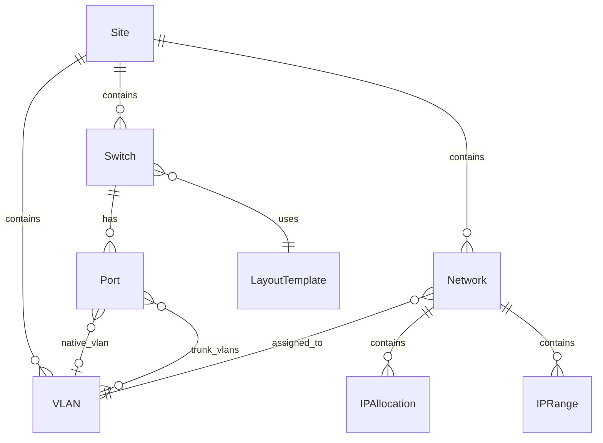

# API-Referenz

Alle Endpunkte erfordern eine Authentifizierung per JWT-Cookie, außer `/api/health`, `/api/auth/login` und `/api/auth/setup`.

## Datenmodell

---

## Authentifizierung

| Methode | Endpunkt | Beschreibung |
|---------|----------|--------------|
| POST | `/api/auth/login` | Anmelden und JWT-Cookie erhalten |
| POST | `/api/auth/logout` | Abmelden und JWT-Cookie löschen |
| GET | `/api/auth/me` | Aktuell authentifizierten Benutzer abrufen |
| POST | `/api/auth/setup` | Ersteinrichtung des Admin-Kontos |

## Switches

| Methode | Endpunkt | Beschreibung |
|---------|----------|--------------|
| GET | `/api/switches` | Alle Switches auflisten |
| POST | `/api/switches` | Neuen Switch erstellen |
| GET | `/api/switches/:id` | Switch nach ID abrufen |
| PUT | `/api/switches/:id` | Switch nach ID aktualisieren |
| DELETE | `/api/switches/:id` | Switch nach ID löschen |
| POST | `/api/switches/:id/duplicate` | Switch duplizieren |
| PUT | `/api/switches/sort` | Sortierreihenfolge der Switches aktualisieren |

## Switch-Ports

| Methode | Endpunkt | Beschreibung |
|---------|----------|--------------|
| PUT | `/api/switches/:id/ports/:portId` | Switch-Port aktualisieren |
| DELETE | `/api/switches/:id/ports/:portId` | Switch-Port löschen |
| PUT | `/api/switches/:id/ports/bulk` | Switch-Ports per Massenoperation aktualisieren |

## Switch-LAG-Gruppen

| Methode | Endpunkt | Beschreibung |
|---------|----------|--------------|
| GET | `/api/switches/:id/lag-groups` | LAG-Gruppen eines Switches auflisten |
| POST | `/api/switches/:id/lag-groups` | LAG-Gruppe erstellen |
| GET | `/api/switches/:id/lag-groups/:id` | LAG-Gruppe nach ID abrufen |
| PUT | `/api/switches/:id/lag-groups/:id` | LAG-Gruppe nach ID aktualisieren |
| DELETE | `/api/switches/:id/lag-groups/:id` | LAG-Gruppe nach ID löschen |

## VLANs

| Methode | Endpunkt | Beschreibung |
|---------|----------|--------------|
| GET | `/api/vlans` | Alle VLANs auflisten |
| POST | `/api/vlans` | Neues VLAN erstellen |
| GET | `/api/vlans/:id` | VLAN nach ID abrufen |
| PUT | `/api/vlans/:id` | VLAN nach ID aktualisieren |
| DELETE | `/api/vlans/:id` | VLAN nach ID löschen |
| GET | `/api/vlans/:id/references` | Objekte abrufen, die dieses VLAN referenzieren |
| GET | `/api/vlans/suggest-color` | Farbvorschlag für ein neues VLAN |

## Netzwerke

| Methode | Endpunkt | Beschreibung |
|---------|----------|--------------|
| GET | `/api/networks` | Alle Netzwerke auflisten |
| POST | `/api/networks` | Neues Netzwerk erstellen |
| GET | `/api/networks/:id` | Netzwerk nach ID abrufen |
| PUT | `/api/networks/:id` | Netzwerk nach ID aktualisieren |
| DELETE | `/api/networks/:id` | Netzwerk nach ID löschen |
| GET | `/api/networks/:id/references` | Objekte abrufen, die dieses Netzwerk referenzieren |
| GET | `/api/networks/:id/utilization` | IP-Auslastungsstatistiken des Netzwerks abrufen |

## Netzwerk-IP-Zuweisungen

| Methode | Endpunkt | Beschreibung |
|---------|----------|--------------|
| GET | `/api/networks/:id/allocations` | Zuweisungen eines Netzwerks auflisten |
| POST | `/api/networks/:id/allocations` | IP-Zuweisung erstellen |
| GET | `/api/networks/:id/allocations/:allocId` | Zuweisung nach ID abrufen |
| PUT | `/api/networks/:id/allocations/:allocId` | Zuweisung nach ID aktualisieren |
| DELETE | `/api/networks/:id/allocations/:allocId` | Zuweisung nach ID löschen |

## Netzwerk-IP-Bereiche

| Methode | Endpunkt | Beschreibung |
|---------|----------|--------------|
| GET | `/api/networks/:id/ranges` | IP-Bereiche eines Netzwerks auflisten |
| POST | `/api/networks/:id/ranges` | IP-Bereich erstellen |
| GET | `/api/networks/:id/ranges/:rangeId` | IP-Bereich nach ID abrufen |
| PUT | `/api/networks/:id/ranges/:rangeId` | IP-Bereich nach ID aktualisieren |
| DELETE | `/api/networks/:id/ranges/:rangeId` | IP-Bereich nach ID löschen |

## Layout-Templates

| Methode | Endpunkt | Beschreibung |
|---------|----------|--------------|
| GET | `/api/layout-templates` | Alle Layout-Templates auflisten |
| POST | `/api/layout-templates` | Layout-Template erstellen |
| GET | `/api/layout-templates/:id` | Layout-Template nach ID abrufen |
| PUT | `/api/layout-templates/:id` | Layout-Template nach ID aktualisieren |
| DELETE | `/api/layout-templates/:id` | Layout-Template nach ID löschen |
| POST | `/api/layout-templates/:id/duplicate` | Layout-Template duplizieren |
| GET | `/api/layout-templates/:id/export` | Layout-Template als Datei exportieren |
| POST | `/api/layout-templates/import` | Layout-Template aus Datei importieren |

## Benutzer

| Methode | Endpunkt | Beschreibung |
|---------|----------|--------------|
| GET | `/api/users` | Alle Benutzer auflisten |
| POST | `/api/users` | Neuen Benutzer erstellen |
| GET | `/api/users/:id` | Benutzer nach ID abrufen |
| PUT | `/api/users/:id` | Benutzer nach ID aktualisieren |
| DELETE | `/api/users/:id` | Benutzer nach ID löschen |
| PUT | `/api/users/:id/password` | Benutzerpasswort ändern |

## Einstellungen

| Methode | Endpunkt | Beschreibung |
|---------|----------|--------------|
| GET | `/api/settings` | Anwendungseinstellungen abrufen |
| PUT | `/api/settings` | Anwendungseinstellungen aktualisieren |

## Dashboard & Werkzeuge

| Methode | Endpunkt | Beschreibung |
|---------|----------|--------------|
| GET | `/api/health` | Health-Check-Endpunkt (keine Auth.) |
| GET | `/api/dashboard/stats` | Dashboard-Statistiken abrufen |
| GET | `/api/search` | Globale Suche über alle Entitäten |
| GET | `/api/subnet-calculator` | Subnetz-Details aus CIDR berechnen |

### Topologie

| Methode | Endpunkt | Beschreibung |
|---------|----------|-------------|
| GET | `/api/sites/:siteId/topology` | Topologie-Daten (Nodes, Links, Ghost-Nodes) für einen Standort |
| GET | `/api/sites/:siteId/topology-layout` | Gespeicherte Node-Positionen abrufen |
| PUT | `/api/sites/:siteId/topology-layout` | Node-Positionen speichern |
| DELETE | `/api/sites/:siteId/topology-layout` | Gespeichertes Layout zurücksetzen |

## Datenverwaltung

| Methode | Endpunkt | Beschreibung |
|---------|----------|--------------|
| GET | `/api/backup/export` | Vollständiges Backup als Archiv exportieren |
| POST | `/api/backup/import` | Vollständiges Backup aus Archiv importieren |
| GET | `/api/data/export` | Alle Daten als JSON exportieren |
| POST | `/api/data/import` | Alle Daten aus JSON importieren |
| GET | `/api/data/template` | Leere Datenvorlage herunterladen |
| GET | `/api/export/:entity` | Einzelnen Entitätstyp als CSV exportieren |
| POST | `/api/import/:entity` | Einzelnen Entitätstyp aus CSV importieren |
| GET | `/api/import/template/:entity` | CSV-Vorlage für Entität herunterladen |

## Aktivität

| Methode | Endpunkt | Beschreibung |
|---------|----------|--------------|
| GET | `/api/activity` | Aktuelle Aktivitätsprotokoll-Einträge auflisten |
| POST | `/api/activity/:id/undo` | Aktivitätsprotokoll-Eintrag rückgängig machen |
