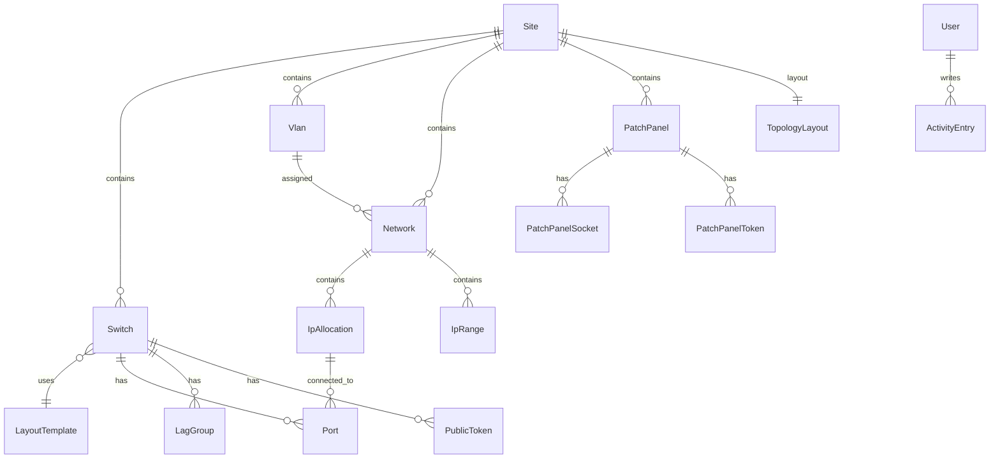

# API-Referenz

## Authentifizierung und öffentliche Ausnahmen

Standardmäßig benötigt `/api/**` ein gültiges JWT-Cookie.

Öffentliche Ausnahmen aus `server/middleware/auth.ts`:

- `POST /api/auth/setup`
- `POST /api/auth/login`
- `POST /api/auth/logout`
- `GET /api/health`
- `GET /api/setup/status`
- `GET /api/changelog`
- `GET /api/version-latest`
- `GET /api/settings` (Sonderfall-Ausnahme)
- `GET /api/p/:token` (öffentliche Switch-Ansicht)
- `GET /api/p/pp/:token` (öffentliche Patch-Panel-Ansicht; nur verfügbar, wenn Patch Panels aktiviert sind)

---

## Datenmodell (aktuell)


```mermaid
erDiagram
    Site ||--o{ Switch : contains
    Site ||--o{ Vlan : contains
    Site ||--o{ Network : contains
    Site ||--o{ PatchPanel : contains

    Switch }o--|| LayoutTemplate : uses
    Switch ||--o{ Port : has
    Switch ||--o{ LagGroup : has
    Switch ||--o{ PublicToken : has

    PatchPanel ||--o{ PatchPanelSocket : has
    PatchPanel ||--o{ PatchPanelToken : has

    Vlan ||--o{ Network : assigned
    Network ||--o{ IpAllocation : contains
    Network ||--o{ IpRange : contains
    IpAllocation ||--o{ Port : connected_to

    Site ||--|| TopologyLayout : layout
    User ||--o{ ActivityEntry : writes
```

---

## Authentifizierung

| Methode | Endpunkt | Beschreibung |
|---------|----------|--------------|
| POST | `/api/auth/login` | Anmelden und JWT-Cookie setzen (öffentlich) |
| POST | `/api/auth/logout` | Abmelden und JWT-Cookie löschen (öffentlich) |
| GET | `/api/auth/me` | Aktuell authentifizierten Benutzer abrufen |
| POST | `/api/auth/setup` | Initiales Admin-Setup (öffentlich bis abgeschlossen) |

## Setup & System

| Methode | Endpunkt | Beschreibung |
|---------|----------|--------------|
| GET | `/api/setup/status` | Setup-/Site-Initialisierungsstatus für den Einrichtungsassistenten (öffentlich) |
| POST | `/api/setup/initial-site` | Erste Site erstellen (Auth erforderlich; nach Initialisierung gesperrt) |
| GET | `/api/health` | Health-Check (öffentlich) |
| GET | `/api/changelog` | Changelog nach Locale lesen (öffentlich) |
| GET | `/api/version-latest` | Neuestes GitHub-Release-Tag abrufen (öffentlich) |

## Einstellungen

| Methode | Endpunkt | Beschreibung |
|---------|----------|--------------|
| GET | `/api/settings` | App-Einstellungen lesen (öffentliche Middleware-Ausnahme) |
| PUT | `/api/settings` | App-Einstellungen aktualisieren |

## Sites

| Methode | Endpunkt | Beschreibung |
|---------|----------|--------------|
| GET | `/api/sites` | Sites auflisten (`search`-Query unterstützt) |
| POST | `/api/sites` | Site erstellen |
| GET | `/api/sites/:id` | Site per ID/Slug abrufen |
| PUT | `/api/sites/:id` | Site per ID/Slug aktualisieren |
| DELETE | `/api/sites/:id` | Site löschen (kaskadiert site-spezifische Daten) |

## Switches

| Methode | Endpunkt | Beschreibung |
|---------|----------|--------------|
| GET | `/api/switches` | Switches auflisten (`site_id`-Filter unterstützt) |
| POST | `/api/switches` | Switch erstellen |
| GET | `/api/switches/:id` | Switch per UUID oder Slug abrufen (`siteId`-Query zur Eindeutigkeit) |
| PUT | `/api/switches/:id` | Switch aktualisieren |
| DELETE | `/api/switches/:id` | Switch löschen |
| POST | `/api/switches/:id/duplicate` | Switch duplizieren |
| PUT | `/api/switches/sort` | Sortierreihenfolge aktualisieren |

### Switch-Ports und konfigurierte VLANs

| Methode | Endpunkt | Beschreibung |
|---------|----------|--------------|
| PUT | `/api/switches/:id/ports/:portId` | Einzelnen Port aktualisieren |
| DELETE | `/api/switches/:id/ports/:portId` | Einzelnen Port zurücksetzen/leeren |
| PUT | `/api/switches/:id/ports/bulk` | Ausgewählte Ports im Bulk aktualisieren |
| PUT | `/api/switches/:id/configured-vlans` | Konfigurierte VLANs hinzufügen/entfernen/entfernen-bestätigt |

### LAG-Gruppen

| Methode | Endpunkt | Beschreibung |
|---------|----------|--------------|
| GET | `/api/switches/:id/lag-groups` | LAG-Gruppen eines Switches auflisten |
| POST | `/api/switches/:id/lag-groups` | LAG-Gruppe erstellen |
| GET | `/api/switches/:id/lag-groups/:lagId` | LAG-Gruppe abrufen |
| PUT | `/api/switches/:id/lag-groups/:lagId` | LAG-Gruppe aktualisieren |
| DELETE | `/api/switches/:id/lag-groups/:lagId` | LAG-Gruppe löschen |

### Lebenszyklus öffentlicher Switch-Tokens

| Methode | Endpunkt | Beschreibung |
|---------|----------|--------------|
| GET | `/api/switches/:id/public-token` | Letzten aktiven Token abrufen |
| POST | `/api/switches/:id/public-token` | Neuen Token erzeugen |
| DELETE | `/api/switches/:id/public-token` | Aktiven Token widerrufen |

## Öffentliche Switch- und Patch-Panel-Routen (read-only)

| Methode | Endpunkt | Beschreibung |
|---------|----------|--------------|
| GET | `/api/p/:token` | Öffentliche Switch-Payload über Token |
| GET | `/api/p/pp/:token` | Öffentliche Patch-Panel-Payload über Token (Patch Panels müssen aktiviert sein) |

## Patch Panels (settings-gated)

Alle authentifizierten Patch-Panel-Routen liefern einen Fehler, wenn `patch_panels_enabled` auf `false` steht.

| Methode | Endpunkt | Beschreibung |
|---------|----------|--------------|
| GET | `/api/patch-panels` | Patch Panels auflisten (`site_id`-Filter unterstützt) |
| POST | `/api/patch-panels` | Patch Panel erstellen (12/24/48 Ports) |
| GET | `/api/patch-panels/:id` | Patch Panel per UUID oder Slug abrufen (`siteId`-Query unterstützt) |
| PUT | `/api/patch-panels/:id` | Patch-Panel-Metadaten aktualisieren |
| DELETE | `/api/patch-panels/:id` | Patch Panel löschen |
| PUT | `/api/patch-panels/:id/sockets/:socketId` | Metadaten eines Ports/Sockets aktualisieren |

### Lebenszyklus öffentlicher Patch-Panel-Tokens

| Methode | Endpunkt | Beschreibung |
|---------|----------|--------------|
| GET | `/api/patch-panels/:id/public-token` | Letzten aktiven Token abrufen |
| POST | `/api/patch-panels/:id/public-token` | Neuen Token erzeugen |
| DELETE | `/api/patch-panels/:id/public-token` | Aktiven Token widerrufen |

## VLANs

| Methode | Endpunkt | Beschreibung |
|---------|----------|--------------|
| GET | `/api/vlans` | VLANs auflisten (`site_id`-Filter unterstützt) |
| POST | `/api/vlans` | VLAN erstellen |
| GET | `/api/vlans/:id` | VLAN abrufen |
| PUT | `/api/vlans/:id` | VLAN aktualisieren |
| DELETE | `/api/vlans/:id` | VLAN löschen |
| GET | `/api/vlans/:id/references` | Abhängigkeits-Referenzen abrufen |
| GET | `/api/vlans/suggest-color` | Unbenutzte VLAN-Farbe vorschlagen |

## Subnetze (`/api/networks`)

::: tip
In der UI heißt diese Entität **Subnetze**. Aus Kompatibilitätsgründen bleiben die API-Pfade bei `/api/networks`.
:::

| Methode | Endpunkt | Beschreibung |
|---------|----------|--------------|
| GET | `/api/networks` | Subnetze auflisten (`site_id`-Filter unterstützt) |
| POST | `/api/networks` | Subnetz erstellen |
| GET | `/api/networks/:id` | Subnetz abrufen |
| PUT | `/api/networks/:id` | Subnetz aktualisieren |
| DELETE | `/api/networks/:id` | Subnetz löschen |
| GET | `/api/networks/:id/references` | Abhängigkeits-Referenzen abrufen |
| GET | `/api/networks/:id/utilization` | Subnetz-Auslastung abrufen |

### IP-Zuweisungen

| Methode | Endpunkt | Beschreibung |
|---------|----------|--------------|
| GET | `/api/networks/:id/allocations` | Zuweisungen im Subnetz auflisten |
| POST | `/api/networks/:id/allocations` | Zuweisung erstellen |
| GET | `/api/networks/:id/allocations/:allocId` | Zuweisung abrufen |
| PUT | `/api/networks/:id/allocations/:allocId` | Zuweisung aktualisieren |
| DELETE | `/api/networks/:id/allocations/:allocId` | Zuweisung löschen |
| GET | `/api/networks/:id/allocations/:allocId/references` | Switch-Ports auflisten, die mit dieser Zuweisung verbunden sind |

### IP-Bereiche

| Methode | Endpunkt | Beschreibung |
|---------|----------|--------------|
| GET | `/api/networks/:id/ranges` | Bereiche im Subnetz auflisten |
| POST | `/api/networks/:id/ranges` | Bereich erstellen |
| GET | `/api/networks/:id/ranges/:rangeId` | Bereich abrufen |
| PUT | `/api/networks/:id/ranges/:rangeId` | Bereich aktualisieren |
| DELETE | `/api/networks/:id/ranges/:rangeId` | Bereich löschen |

### Site-spezifischer Allocation-Feed

| Methode | Endpunkt | Beschreibung |
|---------|----------|--------------|
| GET | `/api/sites/:siteId/ip-allocations` | Erweiterte Zuweisungen für eine Site (oder `siteId=all`) |

## Layout-Templates

| Methode | Endpunkt | Beschreibung |
|---------|----------|--------------|
| GET | `/api/layout-templates` | Templates auflisten |
| POST | `/api/layout-templates` | Template erstellen |
| GET | `/api/layout-templates/:id` | Template abrufen |
| PUT | `/api/layout-templates/:id` | Template aktualisieren |
| DELETE | `/api/layout-templates/:id` | Template löschen |
| POST | `/api/layout-templates/:id/duplicate` | Template duplizieren |
| GET | `/api/layout-templates/:id/export` | Einzelnes Template exportieren |
| POST | `/api/layout-templates/import` | Template-Payload importieren |

## Benutzer

| Methode | Endpunkt | Beschreibung |
|---------|----------|--------------|
| GET | `/api/users` | Benutzer auflisten |
| POST | `/api/users` | Benutzer erstellen |
| GET | `/api/users/:id` | Benutzer abrufen |
| PUT | `/api/users/:id` | Benutzer aktualisieren |
| DELETE | `/api/users/:id` | Benutzer löschen |
| PUT | `/api/users/:id/password` | Passwort ändern |

## Suche, Dashboard, Topologie, Tools

| Methode | Endpunkt | Beschreibung |
|---------|----------|--------------|
| GET | `/api/search` | Globale Suche (Switches/VLANs/Subnetze/Zuweisungen/Bereiche/Templates/LAGs/Patch Panels) |
| GET | `/api/dashboard/stats` | Dashboard-Zähler/Auslastung |
| GET | `/api/subnet-calculator` | CIDR-Rechner |
| GET | `/api/sites/:siteId/topology` | Topologie-Graph-Payload |
| GET | `/api/sites/:siteId/topology-layout` | Gespeicherte Topologie-Positionen abrufen |
| PUT | `/api/sites/:siteId/topology-layout` | Topologie-Positionen speichern |
| DELETE | `/api/sites/:siteId/topology-layout` | Topologie-Positionen zurücksetzen |

## Device Library

| Methode | Endpunkt | Beschreibung |
|---------|----------|--------------|
| GET | `/api/device-library/search` | NetBox Device-Type-Library über GitHub API durchsuchen |
| GET | `/api/device-library/device` | Einzelnes NetBox-YAML laden und in ezSWM-Template konvertieren |

Beide Endpunkte benötigen Internetzugriff auf GitHub und können bei Ausfall `503` zurückgeben.

## Datenverwaltung und Import/Export

| Methode | Endpunkt | Beschreibung |
|---------|----------|--------------|
| GET | `/api/backup/export` | Vollständiges DB-Backup als JSON (`schema: "sqlite-v1"`) |
| POST | `/api/backup/import` | Vollständige DB-Wiederherstellung aus Backup-Payload |
| GET | `/api/data/export` | Alias von Backup-Export |
| POST | `/api/data/import` | Legacy-Endpunkt für Entity-Import (`{ type, data[] }`) |
| GET | `/api/data/template` | CSV-Header-Vorlage für Legacy-Import |
| GET | `/api/export/:entity` | Eine Entity-Tabelle (`switches|vlans|networks|allocations|templates`) als JSON/CSV exportieren |
| POST | `/api/import/:entity` | Per-Entity-Bulk-Import (`switches|vlans|networks|allocations|ranges|templates`) |
| GET | `/api/import/template/:entity` | JSON-Importvorlage für unterstützte Entity |

### Aktuelle Full-Backup-Payload

`/api/backup/export` und `/api/data/export` enthalten aktuell:

```json
{
  "version": "0.37.1",
  "created_at": "2026-09-04T00:00:00.000Z",
  "schema": "sqlite-v1",
  "data": {
    "sites": [...],
    "users": [...],
    "switches": [...],
    "ports": [...],
    "vlans": [...],
    "networks": [...],
    "ipAllocations": [...],
    "ipRanges": [...],
    "layoutTemplates": [...],
    "lagGroups": [...],
    "activity": [...],
    "settings": [...],
    "publicTokens": [...],
    "topologyLayouts": [...]
  }
}
```

Patch-Panel-Tabellen (`patchPanels`, `patchPanelSockets`, `patchPanelTokens`) gehören zum Live-Datenmodell, sind aber in dieser Full-Backup-Payload aktuell noch nicht enthalten.

## Aktivität

| Methode | Endpunkt | Beschreibung |
|---------|----------|--------------|
| GET | `/api/activity` | Aktivitätseinträge auflisten |
| POST | `/api/activity/:id/undo` | Undo für unterstützte Entitätsänderungen (`create/update/delete` bei einfachen Entitätstypen; nicht unterstützte Kombinationen liefern `422`) |

## Admin-Recovery

| Methode | Endpunkt | Beschreibung |
|---------|----------|--------------|
| POST | `/api/admin/recover-allocations` | Nur Admin: Recovery archivierter IP-Zuweisungen (`?apply=1` führt aus; Standard ist Dry-Run) |
