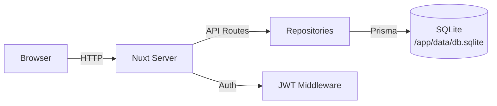

# Benutzerhandbuch

## Erste Schritte

### Erste Anmeldung

Beim ersten Start von ezSWM führt ein Einrichtungsassistent durch zwei Schritte:

1. **Admin-Konto** — wähle einen Benutzernamen, Anzeigenamen und ein Passwort.
2. **Erste Site** — gib deiner ersten Site einen Namen (z. B. `HQ`, `Rechenzentrum`, `LAN-Party`). Sites gruppieren Switches, VLANs und Subnetze; du kannst sie später umbenennen oder weitere hinzufügen.

Wenn du von einer Version aktualisierst, die noch keine Sites hatte, überspringt der Wizard Schritt 1 und fragt nur nach dem Site-Namen. Alle vorhandenen Switches, VLANs und Subnetze werden automatisch der angelegten Site zugeordnet.

Nach der Einrichtung wirst du zum Anmeldebildschirm weitergeleitet.

### Dashboard-Übersicht

Nach der Anmeldung bietet das Dashboard eine Zusammenfassung deiner Infrastruktur: Gesamtzahl der Switches, VLANs, Subnetze und IP-Auslastung. Die Seitenleiste links ermöglicht den Zugriff auf alle Bereiche. Die Kopfleiste enthält die globale Suche, einen Theme-Umschalter (Dunkel/Hell), Sprachauswahl und Benutzermenü.

### Schutz vor nicht gespeicherten Änderungen

Wenn ein Erstellen- oder Bearbeiten-Formular ungespeicherte Änderungen enthält, warnt ezSWM vor dem Verlassen — sowohl beim Klick auf einen Link innerhalb der App als auch beim Schließen des Browser-Tabs. Speichere die Änderungen oder bestätige das Verlassen, um sie zu verwerfen.

## Layout-Templates

### Was sie sind

Layout-Templates definieren wiederverwendbare Switch-Modell-Definitionen. Anstatt Port-Layouts für jeden Switch manuell zu konfigurieren, erstellst du einmal ein Template (z.B. "Cisco C9300-48P") und weist es beliebig vielen Switches zu. Das Template bestimmt, wie viele Ports angezeigt werden, deren Typen und wie sie visuell angeordnet sind.

### Erstellung eines Templates

Navigiere zu **Layout-Templates** in der Seitenleiste und klicke auf **Template erstellen**. Ein Dialog bietet zwei Optionen:

- **Manuell** -- ein Template von Grund auf erstellen
- **Aus Bibliothek importieren** -- aus der [NetBox Device Type Library](https://github.com/netbox-community/devicetype-library) importieren (über 5.000 Geräte von über 270 Herstellern)

#### Aus Bibliothek importieren

Suche nach einem beliebigen Gerät anhand von Hersteller oder Modellname (z.B. "Cisco 9200" oder "MikroTik CRS328"). Wähle ein Gerät aus, um eine Port-Raster-Vorschau zu sehen. Klicke auf **Importieren**, um das Erstellungsformular mit dem Port-Layout des Geräts zu befüllen, das du vor dem Speichern anpassen kannst.

Der Import erkennt automatisch:
- Zuordnung von NetBox-Interface-Typen zu ezSWM-Port-Typen (RJ45, SFP, SFP+, QSFP, Console, Management)
- Erkennung von PoE-Fähigkeiten und Zuweisung an Port-Blöcke
- Deduplizierung von Combo-Ports (z.B. Juniper ge/xe am selben physischen Slot)
- Filterung nicht-physischer Interfaces (WiFi, Stacking, virtuell)
- Extraktion von Datenblatt-URLs und Luftstromrichtung aus Gerätemetadaten

Wenn einige Interfaces nicht unterstützt werden, zeigt ein Warnbanner an, welche Typen übersprungen wurden.

::: tip
Die Bibliothek wird bei Bedarf von GitHub abgerufen. Eine Internetverbindung ist erforderlich. Bei Nichtverfügbarkeit wird eine Fehlermeldung angezeigt.
:::

#### Manuelle Erstellung

**Grundfelder:**

- **Name** (erforderlich) -- ein beschreibender Name, z.B. "UniFi USW-48-PoE"
- **Hersteller** -- z.B. "Ubiquiti"
- **Modell** -- z.B. "USW-48-PoE"
- **Beschreibung** -- optionale Notizen
- **Datenblatt-URL** -- Link zum Datenblatt des Herstellers (optional)
- **Luftstrom** -- Kühlungsrichtung: Front nach Hinten, Hinten nach Front, Passiv, etc. (optional)

**Einheiten:**

Ein Template hat eine oder mehrere Einheiten (Höheneinheiten). Jede Einheit enthält einen oder mehrere Port-Blöcke. Klicke auf **Einheit hinzufügen**, um zusätzliche Einheiten für stapelbare oder mehrteilige Switches hinzuzufügen.

**Port-Blöcke:**

Jeder Block definiert eine Gruppe von Ports innerhalb einer Einheit:

- **Typ** -- RJ45, SFP, SFP+, QSFP, Console oder Management
- **Anzahl** -- Anzahl der Ports in diesem Block
- **Startindex** -- die erste Portnummer (Standard 1)
- **Reihen** -- wie viele Reihen dargestellt werden (1 für einreihig, 2 für zweireihig wie bei den meisten 48-Port-Switches)
- **Reihen-Layout** -- wie Ports auf die Reihen verteilt werden:
  - **Sequenziell** -- füllt zuerst die obere Reihe, dann die untere
  - **Ungerade/Gerade** -- ungerade Ports oben, gerade unten
  - **Gerade/Ungerade** -- gerade Ports oben, ungerade unten
- **Standardgeschwindigkeit** -- 100M, 1G, 2.5G, 10G oder 100G
- **Label** -- optionales Präfix für Port-Bezeichnungen
- **PoE** -- Power over Ethernet Typ: 802.3af (15W), 802.3at (30W), 802.3bt Type 3 (60W), 802.3bt Type 4 (100W), Passive 24V oder Passive 48V. Aus diesem Block generierte Ports erben die PoE-Einstellung. PoE-Ports werden mit einem gelben "PoE"-Label im Port-Raster gekennzeichnet.
- **Physischer Typ** -- (nur Management-Ports) RJ45 oder SFP, um den physischen Steckertyp anzugeben

### Smart Labels

Wenn das Block-Label mit einem Trennzeichen (`/`, `-`, `:` oder `.`) endet, wird der Port-Index direkt angehängt. Zum Beispiel erzeugt ein Label `Gi1/0/` die Ports `Gi1/0/1`, `Gi1/0/2`, usw. Ohne abschließendes Trennzeichen wird das Label mit der Einheit und dem Port-Index kombiniert, z.B. `Label 1/1`.

### Live-Vorschau

Während du Einheiten und Blöcke konfigurierst, wird am unteren Rand des Formulars eine Live-Port-Raster-Vorschau gerendert, damit du das Layout vor dem Speichern überprüfen kannst.

## Switches

### Switch erstellen

Navigiere zu **Switches** in der Seitenleiste und klicke auf **Erstellen**.

Felder:

- **Name** (erforderlich) -- z.B. "Core-SW-01"
- **Modell** -- Hardware-Modell
- **Hersteller** -- Hardware-Hersteller
- **Seriennummer** -- für die Inventarverfolgung
- **Standort** -- physischer Standort, z.B. "Serverraum A, Rack 3"
- **Rack-Position** -- Position innerhalb des Racks
- **Management-IP** -- muss eine gültige IPv4-Adresse sein
- **Firmware-Version** -- aktuell laufende Firmware
- **Layout-Template** -- wähle ein zuvor erstelltes Template; dies generiert das Port-Raster. Falls kein passendes Template existiert, klicke auf **Neue erstellen** neben dem Dropdown — das Schnell-Modal bietet zwei Tabs:
  - **Manuell** -- Name, Port-Anzahl und Port-Typ manuell eingeben.
  - **Aus Bibliothek importieren** -- Gerät in der NetBox Device Type Library suchen (nach Hersteller oder Modell), Port-Layout in der Vorschau prüfen und per **Import** das Template automatisch anlegen. Hersteller und Modell werden direkt aus der Gerätedefinition übernommen.

  In beiden Fällen wird das neue Template sofort zur Liste hinzugefügt und vorausgewählt. Wenn ein Template mit Hersteller- oder Modellangabe gewählt wird, werden diese Felder im Switch-Formular automatisch vorausgefüllt (editierbar; manuelle Änderungen sperren das Feld). Über **Vollen Editor öffnen** gelangst du zu erweiterten Optionen mit mehreren Units, Blöcken und PoE-Einstellungen.
- **Stack-Größe** -- Anzahl der Stacking-Mitglieder (1-8). Nur sichtbar, wenn ein Template ausgewählt ist. Bei mehr als 1 werden die Template-Ports für jedes Stack-Mitglied dupliziert, mit automatisch inkrementierten Port-Labels (z.B. GigabitEthernet1/0/1 für Mitglied 1, GigabitEthernet2/0/1 für Mitglied 2). Das Port-Raster zeigt eine visuelle Trennung zwischen Stack-Mitgliedern.
- **Rolle** -- Core, Distribution, Access oder Management
- **Tags** -- frei definierbare Tags; tippe und drücke Enter zum Hinzufügen, klicke auf einen Tag zum Entfernen
- **Notizen** -- Freitext

### Port-Visualisierung

Auf der Switch-Detailseite werden Ports als visuelles Raster entsprechend dem Layout-Template dargestellt. Ports sind nach ihrem zugewiesenen VLAN farbcodiert. Trunk-Ports (mit mehreren VLANs) zeigen einen Kreis-Indikator mit Ring. Access-Ports zeigen einen quadratischen Indikator. Nicht zugewiesene Ports erscheinen in einer neutralen Farbe.

Unterhalb des Port-Rasters fasst eine **Legende** alle visuellen Indikatoren zusammen: Port-Status (aktiv/inaktiv/deaktiviert), Port-Typen (SFP/QSFP/Konsole/Mgmt), Port-Modus (Access/Trunk), aktive VLANs mit ihren Farben und LAG-Gruppen. Ein Mehrfachauswahl-Hinweis erinnert an die Port-Mehrfachauswahl (Strg/Cmd + Klick). Der Hinweis verschwindet automatisch, wenn Ports ausgewählt sind.

Die **Info-Leiste** oberhalb des Port-Rasters zeigt die wichtigsten Switch-Details (Modell, Standort, Management-IP, Port-Anzahl, Template). Klicke auf die Leiste, um das vollständige Detail-Panel mit allen Switch-Feldern inline aufzuklappen.

Die **Aktionsleiste** oben rechts bietet schnellen Zugriff auf:

- **VLANs** — öffnet ein Seitenpanel zur Verwaltung der konfigurierten VLANs auf diesem Switch (hinzufügen/entfernen)
- **Details** — öffnet ein Seitenpanel mit zwei Tabs:
  - **Ports** — eine tabellarische Ansicht aller Ports mit Status-Zusammenfassung
  - **Aktivität** — letzte Änderungen an diesem Switch

### Ports bearbeiten

Klicke auf einen beliebigen Port im Raster, um ein Seitenpanel zu öffnen. Dort kannst du konfigurieren:

- **Native VLAN** -- das ungetaggte VLAN für diesen Port
- **Getaggte VLANs** -- zusätzliche VLANs auf einem Trunk
- **Geschwindigkeit** -- Standardgeschwindigkeit überschreiben
- **Status** -- up, down oder disabled
- **Verbundenes Gerät** -- was an diesem Port angeschlossen ist (siehe unten)
- **PoE** -- PoE für diesen spezifischen Port überschreiben oder deaktivieren (standardmäßig vom Template-Block geerbt)
- **Beschreibung** -- Port-spezifische Notizen

### Massen-Port-Bearbeitung

Wähle mehrere Ports aus, indem du **Strg** (oder **Cmd** auf Mac) gedrückt hältst und klickst, dann verwende die Massenbearbeitungsaktion, um dasselbe VLAN, dieselbe Geschwindigkeit oder denselben Status auf alle ausgewählten Ports gleichzeitig anzuwenden.

### Verbundene Geräte verknüpfen

Jeder Port kann erfassen, was an ihm angeschlossen ist. Zwei Modi sind verfügbar:

- **Freitext** -- gib einen Gerätenamen manuell ein (z.B. "AP-Floor2-West")
- **Switch-Referenz** -- verknüpfe mit einem anderen Switch und Port in ezSWM; dies erstellt eine bidirektionale Verbindung, die synchron bleibt, wenn eine Seite aktualisiert wird

### Drag & Drop Sortierung

Auf der Switch-Listenseite kannst du Switches per Drag & Drop umsortieren. Die Sortierreihenfolge wird gespeichert und in allen Ansichten angezeigt.

### Favoriten-Switches

Klicke auf das **Herz-Symbol** auf einer Switch-Karte, um den Switch als Favorit zu markieren. Favorisierte Switches erscheinen oben in der Liste mit einem ausgefüllten Herz-Symbol und sind so leicht auffindbar. Favoriten werden pro Benutzer gespeichert und bleiben über Sitzungen hinweg bestehen.

### Switches drucken

Du kannst Switch-Port-Grids für Beschriftung oder Dokumentation ausdrucken.

**Einzelner Switch:** Fahre mit der Maus über eine Switch-Karte in der Liste und klicke auf das Drucker-Symbol (amber).

**Mehrere Switches:** Klicke auf das Drucker-Symbol in der Toolbar, um den Druck-Picker zu öffnen. Wähle Switches über Checkboxen aus (bei Ansicht aller Standorte nach Site gruppiert) und klicke "Ausgewählte drucken". Bei aktiven Filtern werden nur gefilterte Switches angezeigt.

Die Druckseite öffnet sich in einem neuen Tab und zeigt jeden Switch mit seinem Port-Grid auf weißem Hintergrund. Access-Ports sind mit ihrer VLAN-Farbe eingefärbt. Trunk-Ports sind mit einem schwarzen Punkt markiert. Eine kompakte VLAN-Legende unter jedem Switch zeigt die verwendeten VLANs.

Klicke **Drucken** um den Druckdialog des Browsers zu öffnen, oder nutze **Strg+P**. Die Ausgabe ist für A4-Querformat formatiert, jeder Switch auf einer eigenen Seite.

### Öffentlicher QR-Zugang

Erzeuge einen QR-Code für jeden Switch, der zu einer öffentlichen, schreibgeschützten Mobilansicht führt — kein Login nötig. Ideal für LAN-Partys oder Events, bei denen nicht-technische Helfer die Portbelegung sehen müssen.

**QR-Code erzeugen:** Öffne eine Switch-Detailseite und klicke auf das **QR-Code-Symbol** in der Aktionsleiste oben rechts. Ein Drawer öffnet sich, in dem du:
- **Öffentlichen Link erstellen** — erzeugt einen einzigartigen 32-Zeichen-Token
- **Link kopieren** — kopiert die öffentliche URL in die Zwischenablage
- **SVG / PNG herunterladen** — lädt den QR-Code als Bilddatei herunter
- **Sticker drucken** — öffnet eine druckoptimierte Sticker-Seite
- **Token widerrufen** — macht den QR-Code sofort ungültig

**Sammel-QR-Druck:** Klicke in der Switches-Übersicht auf das **QR-Code-Symbol** in der Toolbar. Wähle Switches über Checkboxen aus und klicke "Sticker drucken". Tokens werden automatisch für Switches erstellt, die noch keinen haben. Die Druckseite zeigt ein 3-Spalten-Sticker-Raster mit QR-Code, Switch-Name, Modell und Standort.

**Öffentliche Mobilansicht:** Beim Scannen des QR-Codes erscheint eine mobilfreundliche Seite mit:
- Switch-Name, Modell und Standort
- Alle Ports mit ihrer VLAN-Zuordnung und Zweck
- Filter-Chips zur Anzeige bestimmter VLANs (z.B. Gaming, Server, Sleeping)
- Klare "Nur Technik — nicht benutzen" Warnungen für Infrastruktur-Ports
- Auf Desktop: zusätzlich die visuelle Port-Grid-Darstellung

Die öffentliche Ansicht erfordert keinen Login, zeigt keine sensiblen Daten (keine Management-IPs, Seriennummern oder interne IDs) und ist mit `noindex` markiert, um Suchmaschinen-Indexierung zu verhindern.

**Helfer-Nutzung (Port-Klassifikation):** Jeder Port kann explizit für die öffentliche Helfer-Ansicht klassifiziert werden. Öffne das Seitenpanel eines Ports und scrolle zum Abschnitt "Öffentliche Helfer-Ansicht":
- **Helfer-Ansicht Rolle** — wähle zwischen Automatisch, Teilnehmer, Telefon + PC, Access Point, Drucker, Orga oder Uplink (Nur Technik)
- **Eigenes Label** — überschreibt das Standard-Rollen-Label (z.B. "VIP-Bereich" statt "Orga")
- **In Helfer-Portliste anzeigen** — deaktivieren, um den Port aus der Helfer-Portliste auszublenden (im Desktop-Grid bleibt er sichtbar)

Bei "Automatisch" wird der Port per Legacy-Inferenz klassifiziert: Uplinks → Nur Technik, Trunk-Ports → Spezialgerät, Access-Ports → Teilnehmer.

Die Helfer-Rolle kann auch per Bulk-Editor auf mehrere Ports gleichzeitig gesetzt werden.

## LAG-Gruppen (Link Aggregation)

### Was sie sind

LAG (Link Aggregation Group) kombiniert mehrere physische Ports zu einer einzigen logischen Verbindung für erhöhte Bandbreite und Redundanz. Bei LACP (Link Aggregation Control Protocol) Setups müssen beide Seiten einer Verbindung mit übereinstimmenden LAG-Gruppen konfiguriert sein.

LAG-Ports werden visuell durch ein **diagonales Streifenmuster** als Overlay gekennzeichnet. Beim Hovern über einen LAG-Port zeigt ein Tooltip den LAG-Namen, die Port-Anzahl und das Remote-Gerät.

### LAG erstellen

1. Navigiere zu einer Switch-Detailseite
2. **Strg+Klick** auf zwei oder mehr Ports zur Mehrfachauswahl
3. Klicke auf die Schaltfläche **LAG erstellen** in der Auswahlleiste
4. Fülle die LAG-Details aus:
   - **Name** (erforderlich) -- z.B. "Uplink-Core"
   - **Beschreibung** -- optionale Notizen
   - **Remote-Gerät** -- wähle den Verbindungsmodus:
     - **Keines** -- kein Remote-Gerät
     - **Switch** -- wähle einen anderen Switch aus der Datenbank; ermöglicht Port-Zuordnung
     - **Freitext** -- gib einen Gerätenamen manuell ein
5. **Port-Zuordnung** -- wenn ein Remote-Gerät gesetzt ist, ordne jeden lokalen Port seinem entsprechenden Remote-Port zu
6. Klicke auf **Erstellen**

Beim Erstellen einer LAG mit einem Remote-Switch wird automatisch eine **Spiegel-LAG auf dem Remote-Switch** mit umgekehrter Port-Zuordnung erstellt.

::: tip
Die Erstellen-Schaltfläche ist deaktiviert mit einem Inline-Hinweis, wenn weniger als 2 Ports ausgewählt sind oder wenn ein ausgewählter Port bereits in einer anderen LAG ist.
:::

### Port-Zuordnung

Bei der Konfiguration einer LAG mit einem Remote-Switch zeigt das Seitenpanel eine Zuordnungstabelle:

| Lokaler Port | | Remote-Port |
|---|---|---|
| Gi1/0/1 | → | Dropdown mit Remote-Ports |
| Gi1/0/2 | → | Dropdown mit Remote-Ports |

Bei Freitext-Remote-Geräten ersetzen Texteingabefelder die Dropdowns.

**Konflikterkennung:**
- Remote-Ports, die bereits in einer anderen LAG auf dem Remote-Switch sind, werden **blockiert** (rote Warnung)
- Remote-Ports mit bestehenden Verbindungen zeigen eine **gelbe Warnung** mit der aktuellen Verbindung; nach Bestätigung kann trotzdem gespeichert werden

### LAG bearbeiten

Klicke auf einen LAG-Chip in der Legende unterhalb des Port-Rasters, um das Bearbeitungs-Seitenpanel zu öffnen. Änderungen an Ports, Remote-Gerät oder Port-Zuordnung werden beim Speichern sowohl auf die lokale als auch auf die Spiegel-LAG angewendet.

### LAG löschen

Klicke auf den **X**-Button auf einem LAG-Chip in der Legende. Der Bestätigungsdialog zeigt:
- Welche lokalen Ports freigegeben werden
- Ob eine Spiegel-LAG auf dem Remote-Switch ebenfalls gelöscht wird

### LAG-Legende

Die LAG-Legende ist Teil der Legenden-Card unterhalb des Port-Rasters. Jede LAG-Gruppe wird als interaktiver Chip mit LAG-Name, Port-Anzahl und Remote-Gerät angezeigt.

- **Hover** über einen LAG-Chip hebt dessen Mitgliedsports hervor (Nicht-Mitglieder werden abgedunkelt)
- **Klick** auf einen Chip zum Bearbeiten der LAG
- **X-Button** zum Löschen der LAG
- Bei mehr als 3 LAGs wird ein **Alle anzeigen (N)** Toggle eingeblendet, der die vollständige Liste aufklappt

### LAG-Port-Synchronisierung

Beim Bearbeiten eines Ports, der zu einer LAG gehört, werden folgende Einstellungen automatisch mit allen anderen LAG-Mitgliedsports synchronisiert:

| Synchronisiert | Individuell |
|----------------|-------------|
| VLAN-Konfiguration (Native, Tagged, Access, Port-Modus) | Beschreibung |
| Geschwindigkeit | MAC-Adresse |
| Status | Verbundener Port (anderer physischer Port am selben Gerät) |
| Verbundenes Gerät | |

### LAG im Port-Seitenpanel

Beim Anzeigen eines LAG-Ports im Seitenpanel zeigt ein **LAG-Gruppe**-Feld den LAG-Namen und einen **Aus LAG entfernen**-Button. Wenn das Entfernen des Ports weniger als 2 Mitglieder übrig lassen würde, wird die gesamte LAG gelöscht.

## Netzwerk-Topologie

### Übersicht

Die Topologie-Seite bietet eine interaktive, standortbezogene Graphen-Visualisierung Ihrer Switch-zu-Switch-Verbindungen. Sie zeigt, wie Switches über Port-Links verbunden sind und hilft dabei, die physische Netzwerkstruktur auf einen Blick zu verstehen.

Navigieren Sie zu **Topologie** in der Seitenleiste (nur sichtbar, wenn ein bestimmter Standort ausgewählt ist — nicht in der "Alle Standorte"-Ansicht).

### Graph-Layout

Switches werden hierarchisch nach ihrer Rolle angeordnet:

- **Core**-Switches erscheinen oben (größte Karten)
- **Distribution**-Switches in der Mitte
- **Access** und andere Switches unten

Der Graph passt sich beim Laden automatisch an den verfügbaren Canvas an. Sie können per **Drag** auf dem Canvas schwenken, per **Scrollrad** zoomen und einzelne Nodes per **Drag** neu positionieren. Verschobene Nodes werden gespeichert und beim nächsten Besuch wiederhergestellt.

### Verbindungstypen

Verbindungen zwischen Switches werden visuell unterschieden:

| Typ | Darstellung | Beschreibung |
|-----|-------------|--------------|
| **Link** | Dünne durchgezogene Linie | Einzelne Port-Verbindung |
| **Trunk** | Gestrichelte Linie | Verbindung mit mehreren VLANs |
| **LAG** | Dicke durchgezogene Linie (blaugrau) | Link Aggregation Group |

Die Legende am unteren Rand des Canvas erklärt alle visuellen Indikatoren.

### Detail-Panel

Klicken Sie auf einen Switch-Node, um das Detail-Panel zu öffnen. Es zeigt:

- Switch-Name, Rolle, Hersteller und Modell
- Standort und Management-IP
- Port-Statistiken (aktiv / inaktiv / deaktiviert)
- Alle Verbindungen gruppiert nach Ziel-Switch, mit Port-Zuordnungen und VLANs

Klicken Sie auf **Switch öffnen** am unteren Rand des Panels, um zur vollständigen Switch-Detailseite zu navigieren.

### Toolbar

Die schwebende Toolbar oben links bietet:

- **+/−** Vergrößern/Verkleinern
- **Einpassen** Ansicht zurücksetzen, um alle Nodes einzupassen
- **Zurücksetzen** Gespeicherte Positionen löschen und Layout neu berechnen
- **Exportieren** Aktuelle Ansicht als PNG-Bild herunterladen

### Gespeicherte Positionen

Wenn Sie einen Node an eine neue Position ziehen, werden alle Node-Positionen automatisch gespeichert. Beim nächsten Seitenaufruf wird das Layout wiederhergestellt. Verwenden Sie den **Zurücksetzen**-Button, um gespeicherte Positionen zu löschen und zum automatischen hierarchischen Layout zurückzukehren.

## VLANs

### VLANs erstellen

Navigiere zu **VLANs** in der Seitenleiste und klicke auf **Erstellen**.

Felder:

- **VLAN-ID** (erforderlich) -- Ganzzahl von 1 bis 4094
- **Name** (erforderlich) -- beschreibender Name, z.B. "Gast-WiFi"
- **Beschreibung** -- optional
- **Status** -- Aktiv oder Inaktiv
- **Routing-Gerät** -- welcher Router/L3-Switch dieses VLAN verarbeitet
- **Farbe** (erforderlich) -- Hex-Farbcode; eine eindeutige Farbe wird automatisch vorgeschlagen, um Duplikate zu vermeiden

### Farbsystem

Jedes VLAN hat eine eindeutige Farbe, die in den Port-Visualisierungen aller Switches angezeigt wird. So lässt sich visuell schnell erkennen, welchem VLAN ein Port zugeordnet ist. Der Farbwähler enthält sowohl eine visuelle Auswahl als auch ein Hex-Eingabefeld.

### VLAN-Detail-Sidepanel

Klicke auf ein VLAN in der Liste, um ein Detail-Sidepanel auf der rechten Seite zu öffnen. Das ausgewählte VLAN wird in der Liste hervorgehoben, was eine klare Master-Detail-Beziehung schafft. Das Sidepanel zeigt:

- Status- und Farb-Badges
- Routing-Gerät
- Beschreibung
- Verknüpfte Subnetze mit Links

### Bearbeiten und Löschen

Im Sidepanel klicke auf das **Bearbeiten-Symbol**, um in den Bearbeitungsmodus zu wechseln. Klicke auf das **Papierkorb-Symbol**, um das VLAN zu löschen. Du kannst auch eine vollständige Detailseite für jedes VLAN mit zusätzlichen Informationen aufrufen.

## Subnetze & IP-Verwaltung

### Subnetze erstellen

Navigiere zu **Subnetze** in der Seitenleiste und klicke auf **Erstellen**. Die Subnetz-Liste unterstützt Sortierung nach Name, Subnetz (numerisch korrekt) und Gateway. Such-, Filter- und Sortierzustand wird in der URL und über Sessions hinweg via localStorage gespeichert.

**Klick-zum-Kopieren**: Auf der Subnetz-Detailseite kannst du auf jede IP-Adresse, Subnetz, Gateway oder Maske klicken um den Wert in die Zwischenablage zu kopieren. Eine Bestätigung erscheint als Toast unten rechts. Dies funktioniert auf allen Detailseiten (Subnetze, Switches, Subnetz-Rechner, Topologie-Panel).

Felder:

- **Name** (erforderlich) -- z.B. "Server-LAN"
- **Subnetz** (erforderlich) -- CIDR-Notation, z.B. `10.0.1.0/24`
- **Gateway** -- z.B. `10.0.1.1`
- **DNS-Server** -- kommagetrennte Liste, z.B. `8.8.8.8, 8.8.4.4`
- **VLAN** -- dieses Subnetz mit einem VLAN aus dem Dropdown verknüpfen
- **Beschreibung** -- optional

### Subnetz-Detail & IP-Übersicht

Die Subnetz-Detailseite zeigt Subnetz-Statistiken (Subnetz, Gateway, Maske, Hosts, Zugewiesene Anzahl, verknüpftes VLAN) in einer kompakten Info-Leiste oben. Klicke auf die Info-Leiste, um zusätzliche Details aufzuklappen (Netzwerkadresse, Broadcast, DNS-Server, Beschreibung) -- dasselbe Muster wie auf der Switch-Detailseite. Ein Auslastungsbalken darunter visualisiert zugewiesene, DHCP-, reservierte und freie Adressbereiche. Zum Bearbeiten des Subnetzes klicke auf das **Stift-Symbol** oben rechts -- dies öffnet ein Sidepanel.

Unter der Info-Leiste zeigt die **IP-Übersicht** alle Einträge in einer einheitlichen, sortierten Liste:

- **Feste Zeilen** (Netzwerkadresse, Gateway, Broadcast) -- in gedämpftem Stil dargestellt
- **IP-Zuweisungen** -- einzelne Host-Einträge mit Hostname, Gerätetyp-Badge, Status-Badge und optionaler MAC-Adresse / Beschreibung
- **IP-Bereiche** -- DHCP-, statische oder reservierte Blöcke mit farbcodiertem linken Rand und IP-Anzahl

**Klick auf eine Zuweisung oder einen Bereich** öffnet das entsprechende Bearbeiten-Sidepanel. Die ausgewählte Zeile wird hervorgehoben, um die Master-Detail-Beziehung zu zeigen. Hover-Aktionen (Bearbeiten/Löschen-Buttons) erscheinen rechts in jeder Zeile.

### IP-Zuweisungen

Klicke auf **Hinzufügen**, um das Hinzufügen/Bearbeiten-Sidepanel zu öffnen. Jede Zuweisung erfasst:

- **IP-Adresse** (erforderlich)
- **Hostname** -- wird als primäre Kennung in der IP-Übersicht angezeigt
- **Gerätetyp** -- Server, Switch, Router, Firewall, Drucker, Telefon, AP, Kamera oder Sonstige (als Badge dargestellt)
- **Status** -- Aktiv, Reserviert oder Inaktiv
- **MAC-Adresse** -- als sekundäre Info in der Zeile angezeigt
- **Beschreibung** -- als sekundäre Info in der Zeile angezeigt

### IP-Bereiche

IP-Bereiche kennzeichnen Adressblöcke für bestimmte Zwecke:

- **DHCP** -- dynamisch vergebene Adressen (blauer Indikator)
- **Statisch** -- manuell zugewiesene Adressen (grüner Indikator)
- **Reserviert** -- für Infrastruktur zurückgehaltene Adressen (gelber Indikator)

Jeder Bereich hat eine Start-IP, End-IP, einen Typ und eine optionale Beschreibung. Die IP-Anzahl wird inline angezeigt.

### Spezielle Subnetze (/31 und /32)

ezSWM behandelt IPv4-Sondersubnetze gemäß ihren RFCs:

- **/31 (Point-to-Point, RFC 3021)** -- Beide Adressen sind nutzbare Endpunkte. Die Detailseite zeigt "Endpunkt A" und "Endpunkt B" statt "Netzwerk" und "Broadcast", mit einem "Point-to-Point"-Badge. DHCP-Bereiche können für /31-Netze nicht erstellt werden.
- **/32 (Host Route)** -- Einzelne Host-Adresse. Die Detailseite zeigt "Host-Adresse" mit einem "Host Route"-Badge. Keine Broadcast-Zeile wird angezeigt. DHCP-Bereiche können für /32-Netze nicht erstellt werden.

Der Subnetz-Rechner verwendet dieselben Labels und Badges.

### Auslastungsverfolgung

Der Auslastungsbalken oben auf der Subnetz-Detailseite visualisiert die Adressraum-Nutzung. Die Legende zeigt Zugewiesene, DHCP, Reservierte und Freie Anzahlen.

## IP-Adressen (site-übergreifend)

Die Seite **IP-Adressen** in der Seitenleiste zeigt eine flache, tabellarische Übersicht aller IP-Zuweisungen über alle Subnetze der aktuellen Site (bzw. aller Sites im „Alle Standorte"-Modus). Praktisch, wenn du eine IP scannen, filtern oder nachschlagen willst, ohne erst in ein bestimmtes Subnetz zu navigieren.

**Spalten:** IP · Hostname · MAC · Subnetz (Name + CIDR) · VLAN (farbiges Badge) · Gerätetyp · Status. Im „Alle Standorte"-Modus kommt zusätzlich eine Standort-Spalte hinzu.

**Filter & Sortierung:** ein Suchfeld matched IP / Hostname / MAC, dazu separate Dropdowns für VLAN, Status und Gerätetyp. Der Filter-Zustand wird in der URL und sessionsübergreifend via localStorage gespeichert. Ein Klick auf den IP-Spaltenkopf sortiert numerisch (`.10` kommt also nach `.9`, nicht nach `.1`). Der Tabellen-Body scrollt intern — Seiten-Header, Filter-Leiste und Spaltenköpfe bleiben sichtbar, auf Desktop und Mobile.

**Zeilen-Klick → Bearbeiten:** ein Klick auf eine Zeile öffnet das Bearbeiten-Sidepanel. Löschen sitzt im Header des Sidepanels — so muss die Tabelle nicht mit Action-Buttons pro Zeile vollgestopft werden.

**IP anlegen:** Klick auf **IP-Adresse hinzufügen**. Sobald du eine gültige IP eintippst, wählt das **Subnetz**-Dropdown automatisch das Subnetz, dessen CIDR sie enthält — kein manuelles Picken nötig. Du kannst die Auswahl jederzeit überschreiben (sinnvoll im „Alle Standorte"-Modus, wenn sich Bereiche über mehrere Sites überlappen). Das zum Subnetz gehörende VLAN wird daneben read-only angezeigt.

**DHCP-Range-Schutz:** Wenn die IP, die du anlegen oder per Bearbeiten dorthin verschieben willst, in eine bestehende DHCP-Range fällt, lehnt das Formular sie mit einer klaren Meldung ab: *IP x.x.x.x is inside a DHCP dynamic range (start – end). Static IPs cannot be assigned within dynamic DHCP ranges.* Das gilt sowohl beim **Anlegen** als auch beim **Bearbeiten**, sodass du eine statische Zuweisung nicht versehentlich durch eine IP-Änderung in den DHCP-Bereich rutschen lassen kannst.

## Globale Suche

Drücke **/** oder klicke auf die Suchleiste in der Kopfleiste, um die globale Suche zu öffnen. Sie durchsucht:

- Switches (nach Name, Standort, Management-IP, Modell, Hersteller, Tags)
- VLANs (nach Name, VLAN-ID)
- Subnetze (nach Name, CIDR)
- IP-Zuweisungen (nach IP, Hostname)
- IP-Bereiche (nach Start-/End-IP, Typ, Subnetz-Name)
- Layout-Templates (nach Name)
- LAG-Gruppen (nach Name, Beschreibung, Remote-Gerät)

Verwende die Pfeiltasten zur Navigation der Ergebnisse und Enter zum Springen zum ausgewählten Element. LAG-Suchergebnisse verlinken direkt zur Switch-Detailseite mit geöffnetem LAG-Bearbeitungs-Seitenpanel.

## Subnetz-Rechner

Navigiere zum **Subnetz-Rechner** in der Seitenleiste. Gib eine beliebige IPv4-Adresse mit CIDR-Präfix ein (z.B. `192.168.1.0/24`) und der Rechner zeigt:

- Netzwerkadresse und Broadcast-Adresse
- Nutzbarer Host-Bereich (erster und letzter Host)
- Gesamtanzahl der Adressen und nutzbare Hosts
- Subnetzmaske in Punkt-Dezimal- und Binärnotation
- Wildcard-Maske
- CIDR-Notation
- IP-Klasse

Dies ist ein rein clientseitiges Werkzeug — es werden keine Daten gespeichert. Nützlich für schnelle Subnetz-Berechnungen bei der Netzwerkplanung.

## Datenverwaltung

### Export

Jeder Entitätstyp (Switches, VLANs, Subnetze, IP-Zuweisungen, IP-Bereiche, Layout-Templates) kann einzeln als JSON oder CSV exportiert werden. Der Tab **Backup & Restore** liefert zusätzlich einen einzelnen JSON-Dump aller Tabellen, markiert mit `schema: "sqlite-v1"`.

### Import & Restore (temporär deaktiviert in 0.21.x)

::: warning Import & Restore werden für SQLite umgebaut
Der 0.21-Storage-Switch hat die Schreibseite des Import-/Restore-Flows auf dem alten JSON-Pfad zurückgelassen, der sich nicht sauber auf das neue Schema mit FK-Constraints übersetzen lässt. Die Import-Endpoints und der Activity-Log-Undo-Button liefern aktuell **`501 Not Implemented`**:

- Per-Entity-Import (CSV/JSON in eine Liste droppen)
- Vollständiger Backup-Restore (Backup & Restore Tab)
- Activity-Log "Rückgängig"-Button

Sie kommen in einem Patch-Release zurück. Die **Export**-Seite funktioniert weiterhin, und ein manuelles Rollback geht über das Zurückspielen einer alten `db.sqlite`-Datei. Fortschritt unter [#156](https://github.com/slgfire/ezswm/issues/156).
:::

### Backup-Format

Backups sind JSON-Dumps der zugrundeliegenden SQLite-Tabellen, ein Array pro Entity, mit einem `schema: "sqlite-v1"`-Marker am Anfang. JSON-Spalten (Tags, `configured_vlans`, `tagged_vlans` auf Ports, Template-`units`, Activity-`changes`/`previous_state`) bleiben als JSON-Strings — der Restore-Pfad parsed sie beim Wiedereinspielen.

## Einstellungen

### Allgemeine Einstellungen

Öffne die Einstellungen über das Benutzermenü in der Kopfleiste oder die Seitenleiste. Allgemeine Einstellungen umfassen die anwendungsweite Konfiguration.

### Kontoeinstellungen

Ändere deinen Anzeigenamen und deine bevorzugte Sprache (Englisch oder Deutsch).

### Passwort ändern

Ändere dein Passwort auf der Kontoeinstellungsseite. Du musst dein aktuelles Passwort eingeben und das neue bestätigen.

## Standorte

### Was sie sind

Standorte repräsentieren physische Orte oder logische Gruppierungen für deine Infrastruktur. Jeder Standort hat eigene Switches, VLANs, Subnetze und Topologie. Verwende Standorte, um verschiedene Orte zu trennen (z.B. "Rechenzentrum", "Büro", "LAN-Party Halle A").

### Standorte verwalten

Navigiere zu **Standorte** in der Seitenleiste, um alle Standorte zu sehen. Klicke auf **Standort erstellen**, um einen neuen hinzuzufügen. Jeder Standort hat einen Namen und eine optionale Beschreibung.

Wenn du einen Standort im Dropdown der Seitenleiste auswählst, werden alle Ansichten (Switches, VLANs, Subnetze, Topologie) auf diesen Standort eingeschränkt. Wähle "Alle Standorte", um alles standortübergreifend zu sehen.

### Erste Site

Die erste Site wird im [Einrichtungsassistenten](#erste-anmeldung) angelegt und du wählst den Namen selbst. Du kannst sie später umbenennen oder jederzeit weitere Sites hinzufügen.

## Architekturübersicht

Das folgende Diagramm zeigt, wie Anfragen durch ezSWM fließen:

### Upgrade auf 0.21.x

Mit 0.21.0 ist der Storage von flachen JSON-Files auf eingebettetes SQLite umgestellt. Beim ersten Start des neuen Images erkennt die App die alten `data/*.json` neben einer leeren Datenbank, führt die einmalige Migration in einer einzigen Transaktion aus (jeder Datensatz bekommt eine frische UUIDv4, alle Cross-References werden gemappt) und verschiebt die originalen JSON-Files nach `data/_archive_<ISO>/`. URLs ändern sich, weil die IDs neu generiert werden — Bookmarks auf einzelne Entities brechen einmalig, das UI selbst ist unverändert. Die exakte Abfolge und der Fehler-Pfad stehen im [Installations-Guide](/de/guide/installation#upgrade-von-0-20-x-auf-0-21-x).
