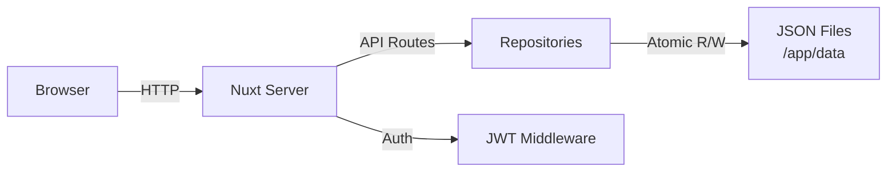

# User Guide

## Getting Started

### First Login

When you launch ezSWM for the first time, a setup wizard guides you through creating an admin account. Enter a username, display name, and password. After setup, you are redirected to the login screen.

### Dashboard Overview

After logging in, the dashboard provides a summary of your infrastructure: total switches, VLANs, networks, and IP utilization. The sidebar on the left gives access to all sections. The header bar contains global search, a theme toggle (dark/light), language selector, and user menu.

## Layout Templates

### What They Are

Layout templates define reusable switch model definitions. Instead of manually configuring port layouts for every switch, you create a template once (e.g., "Cisco C9300-48P") and assign it to any number of switches. The template determines how many ports appear, their types, and how they are visually arranged.

### How to Create One

Navigate to **Layout Templates** in the sidebar and click **Create Template**. A dialog offers two options:

- **Manual** -- build a template from scratch
- **Import from Library** -- import from the [NetBox Device Type Library](https://github.com/netbox-community/devicetype-library) (5,000+ devices from 270+ manufacturers)

#### Import from Library

Search for any device by manufacturer or model name (e.g., "Cisco 9200" or "MikroTik CRS328"). Select a device to see a port grid preview. Click **Import** to populate the create form with the device's port layout, which you can adjust before saving.

The import automatically:
- Maps NetBox interface types to ezSWM port types (RJ45, SFP, SFP+, QSFP, Console, Management)
- Detects PoE capabilities and sets them on port blocks
- Deduplicates combo ports (e.g., Juniper ge/xe on the same physical slot)
- Filters out non-physical interfaces (WiFi, stacking, virtual)
- Extracts datasheet URLs and airflow direction from device metadata

If some interfaces are not supported, a warning banner shows which types were skipped.

::: tip
The library is fetched on-demand from GitHub. An internet connection is required. If unavailable, an error message is shown.
:::

#### Manual Creation

**Basic fields:**

- **Name** (required) -- a descriptive name, e.g., "UniFi USW-48-PoE"
- **Manufacturer** -- e.g., "Ubiquiti"
- **Model** -- e.g., "USW-48-PoE"
- **Description** -- optional notes
- **Datasheet URL** -- link to the manufacturer's datasheet (optional)
- **Airflow** -- cooling direction: Front to Rear, Rear to Front, Passive, etc. (optional)

**Units:**

A template has one or more units (rack units). Each unit contains one or more port blocks. Click **Add Unit** to add additional units for stackable or multi-unit switches.

**Port blocks:**

Each block defines a group of ports within a unit:

- **Type** -- RJ45, SFP, SFP+, QSFP, Console, or Management
- **Count** -- number of ports in this block
- **Start Index** -- the first port number (default 1)
- **Rows** -- how many rows to render (1 for single-row, 2 for dual-row like most 48-port switches)
- **Row Layout** -- how ports are distributed across rows:
  - **Sequential** -- fills top row first, then bottom row
  - **Odd/Even** -- odd-numbered ports on top, even on bottom
  - **Even/Odd** -- even-numbered ports on top, odd on bottom
- **Default Speed** -- 100M, 1G, 2.5G, 10G, or 100G
- **Label** -- optional prefix for port labels
- **PoE** -- Power over Ethernet type: 802.3af (15W), 802.3at (30W), 802.3bt Type 3 (60W), 802.3bt Type 4 (100W), Passive 24V, or Passive 48V. Ports generated from this block inherit the PoE setting. PoE ports are marked with a yellow "PoE" label in the port grid.
- **Physical Type** -- (Management ports only) RJ45 or SFP, to indicate the physical connector type

### Smart Labels

If the block label ends with a separator character (`/`, `-`, `:`, or `.`), the port index is appended directly. For example, a label of `Gi1/0/` produces ports `Gi1/0/1`, `Gi1/0/2`, etc. Without a trailing separator, the label is combined with the unit and port index like `Label 1/1`.

### Live Preview

As you configure units and blocks, a live port grid preview renders at the bottom of the form so you can verify the layout before saving.

## Switches

### Creating a Switch

Navigate to **Switches** in the sidebar and click **Create**.

Fields:

- **Name** (required) -- e.g., "Core-SW-01"
- **Model** -- hardware model
- **Manufacturer** -- hardware vendor
- **Serial Number** -- for inventory tracking
- **Location** -- physical location, e.g., "Server Room A, Rack 3"
- **Rack Position** -- position within the rack
- **Management IP** -- must be a valid IPv4 address
- **Firmware Version** -- currently running firmware
- **Layout Template** -- select a previously created template; this generates the port grid
- **Stack Size** -- number of stacking members (1-8). Only visible when a template is selected. When set to more than 1, the template's ports are duplicated for each stack member with automatically incremented port labels (e.g., GigabitEthernet1/0/1 for member 1, GigabitEthernet2/0/1 for member 2). The port grid shows a visual divider between stack members.
- **Role** -- Core, Distribution, Access, or Management
- **Tags** -- freeform tags; type and press Enter to add, click a tag to remove
- **Notes** -- freetext

### Port Visualization

On a switch detail page, ports are rendered as a visual grid matching the layout template. Ports are color-coded by their assigned VLAN. Trunk ports (carrying multiple VLANs) display a circle indicator with ring. Access ports show a square indicator. Unassigned ports appear in a neutral color.

Below the port grid, a **legend card** summarizes all visual indicators in grouped rows: port status (up/down/disabled), port types (SFP/QSFP/Console/Mgmt), port mode (access/trunk), active VLANs with their colors, and LAG groups. A multi-select hint at the bottom reminds you how to select multiple ports (Ctrl/Cmd + Click). The hint automatically hides when ports are selected.

Two collapsible sections follow the legend card:

- **Port Table** — a tabular view of all ports. The closed header shows port count and status summary (e.g., "7 up · 105 down"). Click to expand the full table.
- **Recent Activity** — shows the latest changes to this switch. The closed header displays the entry count and timestamp of the most recent change (e.g., "20 entries · Latest: 5 min ago").

### Editing Ports

Click any port in the grid to open a slideover panel. From there you can configure:

- **Native VLAN** -- the untagged VLAN for this port
- **Tagged VLANs** -- additional VLANs carried on a trunk
- **Speed** -- override the default speed
- **Status** -- up, down, or disabled
- **Connected Device** -- what is plugged into this port (see below)
- **PoE** -- override or disable PoE for this specific port (inherited from the template block by default)
- **Description** -- port-level notes

### Bulk Port Editing

Select multiple ports by holding **Ctrl** (or **Cmd** on Mac) and clicking, then use the bulk edit action to apply the same VLAN, speed, or status to all selected ports at once.

### Connected Device Linking

Each port can track what is connected to it. Two modes are available:

- **Freetext** -- type a device name manually (e.g., "AP-Floor2-West")
- **Switch Reference** -- link to another switch and port in ezSWM; this creates a bidirectional connection that stays in sync when either end is updated

### Drag & Drop Sort Order

On the switch list page, you can drag switches to reorder them. The sort order is persisted and reflected across all views.

### Favorite Switches

Click the **heart icon** on any switch card to mark it as a favorite. Favorite switches appear at the top of the list with a filled heart icon, making them easy to find. Favorites are stored per user and persist across sessions.

### Printing Switches

You can print switch port grids for labeling or documentation purposes.

**Single switch:** Hover over a switch card in the list and click the printer icon (amber).

**Multiple switches:** Click the printer icon in the toolbar to open the print picker. Select switches via checkboxes (grouped by site when viewing all sites), then click "Print selected". When filters are active, only filtered switches appear in the picker.

The print page opens in a new tab showing each switch with its port grid on a white background. Access ports are tinted with their VLAN color. Trunk ports are marked with a black dot. A compact VLAN legend below each switch shows which VLANs are in use.

Click **Print** to open the browser's print dialog, or use **Ctrl+P**. The output is formatted for A4 landscape with each switch on its own page.

### Public QR Access

Generate a QR code for any switch that links to a public, read-only mobile view — no login required. Ideal for LAN parties or events where non-technical helpers need to see the port layout.

**Generating a QR code:** Open a switch detail page and click the **QR code icon** in the top-right action bar. A drawer opens where you can:
- **Generate Public Link** — creates a unique 32-character token
- **Copy Link** — copies the public URL to clipboard
- **Download SVG / PNG** — downloads the QR code as an image file
- **Print Sticker** — opens a print-optimized sticker page
- **Revoke Token** — invalidates the QR code immediately

**Bulk QR printing:** In the Switches overview, click the **QR code icon** in the toolbar. Select switches via checkboxes, then click "Print Sticker". Tokens are automatically created for switches that don't have one yet. The print page shows a 3-column sticker grid with QR code, switch name, model, and location.

**Public mobile view:** When someone scans the QR code, they see a mobile-friendly page showing:
- Switch name, model, and location
- All ports with their VLAN assignment and purpose
- Filter chips to show only specific VLANs (e.g. Gaming, Server, Sleeping)
- Clear "Tech only — do not use" warnings for infrastructure ports
- On desktop: the full port grid visualization is also shown

The public view does not require login, does not show sensitive data (no management IPs, serial numbers, or internal IDs), and is marked with `noindex` to prevent search engine indexing.

**Helper Usage (Port Classification):** Each port can be explicitly classified for the public helper view. Open a port's side panel and scroll to the "Public Helper View" section:
- **Helper view role** — choose from Automatic, Participant, Phone + PC, Access Point, Printer, Orga, or Uplink (Tech only)
- **Custom label** — override the default role label (e.g. "VIP Area" instead of "Orga")
- **Show in helper port list** — uncheck to hide the port from the helper port list (it still appears in the desktop grid)

If set to "Automatic", the port is classified using the legacy inference: uplinks → Tech only, trunk ports → Special device, access ports → Participant.

You can also set the helper usage role in bulk via the bulk editor.

## LAG Groups (Link Aggregation)

### What They Are

LAG (Link Aggregation Group) combines multiple physical ports into a single logical link for increased bandwidth and redundancy. In LACP (Link Aggregation Control Protocol) setups, both sides of a link must be configured with matching LAG groups.

LAG ports are visually identified by a **diagonal stripe pattern** overlay. Hovering over a LAG port shows a tooltip with the LAG name, port count, and remote device.

### Creating a LAG

1. Navigate to a switch detail page
2. **Ctrl+Click** two or more ports to multi-select them
3. Click the **Create LAG** button in the selection bar
4. Fill in the LAG details:
   - **Name** (required) -- e.g., "Uplink-Core"
   - **Description** -- optional notes
   - **Remote Device** -- choose connection mode:
     - **None** -- no remote device
     - **Switch** -- select another switch from the database; enables port mapping
     - **Freetext** -- type a device name manually
5. **Port Mapping** -- when a remote device is set, map each local port to its corresponding remote port
6. Click **Create**

When creating a LAG with a remote switch, a **mirror LAG is automatically created** on the remote switch with the reverse port mapping.

::: tip
The create button is disabled with an inline hint if fewer than 2 ports are selected or if any selected port is already in another LAG.
:::

### Port Mapping

When configuring a LAG with a remote switch, the slideover shows a mapping table:

| Local Port | | Remote Port |
|---|---|---|
| Gi1/0/1 | → | Dropdown of remote ports |
| Gi1/0/2 | → | Dropdown of remote ports |

For freetext remote devices, text inputs replace the dropdowns.

**Conflict detection:**
- Remote ports already in another LAG on the remote switch are **blocked** (red warning)
- Remote ports with existing connections show an **amber warning** with the current connection; you can still save after confirmation

### Editing a LAG

Click a LAG chip in the legend below the port grid to open the edit slideover. Changes to ports, remote device, or port mapping are applied to both the local and mirror LAG on save.

### Deleting a LAG

Click the **X** button on a LAG chip in the legend. The confirmation dialog shows:
- Which local ports will be released
- Whether a mirror LAG on the remote switch will also be deleted

### LAG Legend

The LAG legend is part of the legend card below the port grid. Each LAG group is shown as an interactive chip with the LAG name, port count, and remote device.

- **Hover** a LAG chip to highlight its member ports (non-members dim)
- **Click** a chip to edit the LAG
- **X button** to delete the LAG
- When more than 3 LAGs exist, a **Show all (N)** toggle expands the full list

### LAG Port Sync

When editing a port that belongs to a LAG, the following settings are automatically synchronized to all other LAG member ports:

| Synced | Individual |
|--------|-----------|
| VLAN config (native, tagged, access, port mode) | Description |
| Speed | MAC address |
| Status | Connected port (different physical port on same device) |
| Connected device | |

### LAG in Port Side Panel

When viewing a LAG port in the side panel, a **LAG Group** field shows the LAG name and a **Remove from LAG** button. If removing the port would leave fewer than 2 members, the entire LAG is deleted.

## Network Topology

### Overview

The topology page provides an interactive, site-scoped graph visualization of your switch-to-switch connections. It shows how switches are connected via port links and helps you understand the physical network structure at a glance.

Navigate to **Topology** in the sidebar (only visible when a specific site is selected — not in the "All Sites" view).

### Graph Layout

Switches are arranged in a hierarchical layout based on their role:

- **Core** switches appear at the top (largest cards)
- **Distribution** switches in the middle
- **Access** and other switches at the bottom

The graph automatically fits to the available canvas on page load. You can **pan** by dragging the canvas, **zoom** with the scroll wheel, and **drag** individual nodes to reposition them. Repositioned nodes are saved and restored on next visit.

### Edge Types

Connections between switches are visually differentiated:

| Type | Appearance | Description |
|------|------------|-------------|
| **Link** | Thin solid line | Single port connection |
| **Trunk** | Dashed line | Connection carrying multiple VLANs |
| **LAG** | Thick solid line (blue-gray) | Link Aggregation Group |

The legend at the bottom of the canvas explains all visual indicators.

### Detail Panel

Click any switch node to open the detail panel. It shows:

- Switch name, role, manufacturer, and model
- Location and management IP
- Port statistics (up / down / disabled)
- All connections grouped by target switch, with port mappings and VLANs

Click **Open Switch** at the bottom of the panel to navigate to the full switch detail page.

### Toolbar

The floating toolbar in the top-left corner provides:

- **+/−** Zoom in/out
- **Fit** Reset view to fit all nodes
- **Reset** Clear saved positions and recalculate layout
- **Export** Download the current view as a PNG image

### Saved Positions

When you drag a node to a new position, all node positions are saved automatically. On the next page load, the layout is restored. Use the **Reset** button to clear saved positions and return to the automatic hierarchical layout.

## VLANs

### Creating VLANs

Navigate to **VLANs** in the sidebar and click **Create**.

Fields:

- **VLAN ID** (required) -- integer from 1 to 4094
- **Name** (required) -- descriptive name, e.g., "Guest WiFi"
- **Description** -- optional
- **Status** -- Active or Inactive
- **Routing Device** -- which router/L3 switch handles this VLAN
- **Color** (required) -- hex color code; a unique color is auto-suggested to avoid duplicates

### Color System

Each VLAN has a unique color that appears on port visualizations across all switches. This makes it easy to visually identify which VLAN a port belongs to. The color picker includes both a visual selector and a hex input field.

### Editing and Deleting

Click a VLAN in the list to view its details. From there you can edit all fields or delete the VLAN. The detail view also shows which switch ports are currently assigned to this VLAN.

## Networks & IP Management

### Creating Networks

Navigate to **Networks** in the sidebar and click **Create**.

Fields:

- **Name** (required) -- e.g., "Server LAN"
- **Subnet** (required) -- CIDR notation, e.g., `10.0.1.0/24`
- **Gateway** -- e.g., `10.0.1.1`
- **DNS Servers** -- comma-separated list, e.g., `8.8.8.8, 8.8.4.4`
- **VLAN** -- associate this network with a VLAN from the dropdown
- **Description** -- optional

### IP Allocations

On a network detail page, you can allocate individual IP addresses within the subnet. Each allocation records the IP address, hostname, MAC address, and a description. This serves as your IP address management (IPAM) registry.

### IP Ranges

Within a network, you can define IP ranges to designate blocks of addresses for specific purposes:

- **DHCP** -- addresses handed out dynamically
- **Static** -- addresses assigned manually
- **Reserved** -- addresses set aside (e.g., for future use or infrastructure)

Each range has a start IP, end IP, name, and type.

### Utilization Tracking

The network detail page displays utilization metrics: total addresses in the subnet, how many are allocated, and how many fall within defined ranges. A visual bar shows overall usage at a glance.

## Global Search

Press **/** or click the search bar in the header to open global search. It searches across:

- Switches (by name, location, management IP, model, manufacturer, tags)
- VLANs (by name, VLAN ID)
- Networks (by name, subnet)
- IP allocations (by IP, hostname)
- Layout templates (by name)
- LAG groups (by name, description, remote device)

Use arrow keys to navigate results and Enter to jump to the selected item. LAG search results deep-link to the switch detail page with the LAG edit slideover open.

## Subnet Calculator

Navigate to **Subnet Calculator** in the sidebar. Enter any IPv4 address with a CIDR prefix (e.g., `192.168.1.0/24`) and the calculator shows:

- Network address and broadcast address
- Usable host range (first and last host)
- Total number of addresses and usable hosts
- Subnet mask in dotted decimal and binary notation
- Wildcard mask
- CIDR notation
- IP class

This is a client-side tool — no data is saved. Useful for quick subnet calculations during network planning.

## Data Management

### Export and Import

Each entity type (switches, VLANs, networks, layout templates) can be individually exported to JSON and imported back. This is useful for transferring specific data between instances.

### Full Backup and Restore

The **Data Management** section in settings provides full backup and restore. A backup produces a single JSON file containing all entities. Restore replaces all data with the contents of a backup file.

### Backup Format

Backups are plain JSON files. They can be version-controlled, diffed, or edited manually if needed.

## Settings

### General Settings

Access settings via the user menu in the header or the sidebar. General settings cover application-level configuration.

### Account Settings

Change your display name and preferred language (English or German).

### Password Change

Change your password from the account settings page. You must provide your current password and confirm the new one.

## Sites

### What They Are

Sites represent physical locations or logical groupings for your infrastructure. Each site has its own switches, VLANs, networks, and topology. Use sites to separate different locations (e.g., "Data Center", "Office", "LAN Party Hall A").

### Managing Sites

Navigate to **Sites** in the sidebar to see all sites. Click **Create Site** to add a new one. Each site has a name and optional description.

When you select a site from the dropdown in the sidebar, all views (switches, VLANs, networks, topology) are scoped to that site. Select "All Sites" to see everything across all locations.

### Default Site

On first setup, a "Default" site is created automatically. You can rename it or create additional sites at any time.

## Architecture Overview

The following diagram shows how requests flow through ezSWM:

