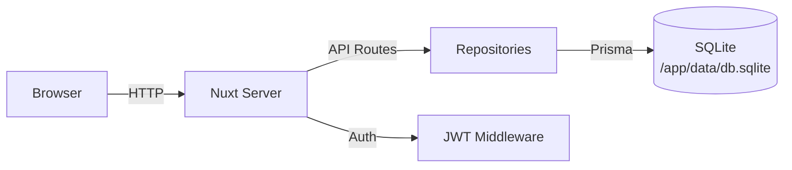

# User Guide

## Getting Started

### First Login

When you launch ezSWM for the first time, a setup wizard guides you through two steps:

1. **Admin account** — pick a username, display name and password.
2. **First site** — give your first site a name (e.g. `HQ`, `Datacenter`, `LAN-Party`). Sites group switches, VLANs and subnets; you can rename it later and add more.

If you're upgrading from a version that did not yet have sites, the wizard skips step 1 and asks only for the site name. Any existing switches, VLANs and subnets are automatically reassigned to the site you create.

After setup, you are redirected to the login screen.

### Dashboard Overview

After logging in, the dashboard provides a summary of your infrastructure: total switches, VLANs, subnets, and IP utilization. The sidebar on the left gives access to all sections. The header bar contains global search, a theme toggle (dark/light), language selector, and user menu.

The interface uses neutral surfaces for layout and decoration. Color remains where it carries information: VLANs keep their assigned colors, while port states and warnings retain their status cues, such as green for up, amber for warnings, and red for down or errors.

### Unsaved Changes Protection

When you have unsaved changes in a create or edit form, ezSWM warns you before navigating away — whether you click another link inside the app or try to close the browser tab. The same protection applies consistently to every editing side panel (switch and port editing, bulk port edits, LAG groups, IP allocations and ranges, networks, VLANs, sites): closing a panel with unsaved changes — by clicking outside it, pressing Escape, or hitting Cancel — prompts you first. Save or explicitly confirm "leave" to discard the changes.

Confirmation dialogs can be dismissed consistently using **Cancel**, the **close button**, **Escape**, or by clicking the **backdrop** (where backdrop closing is enabled).

### Switching Language

Use the language selector in the header bar (top-right, globe icon) to switch between English and German at any time. Your choice is saved to your profile, so it persists across reloads and devices. You can also change it under Settings → Account.

Short introductions on the main pages are available in English and German and follow the language selected for your account.

### Screenshot freshness

Four screenshots in this guide — Dashboard, Layout Templates, Switch list, and Sites — are synthetic examples with demo data, captured before the final sidebar-logo spacing fix (so the logo position may differ slightly from the current interface). Icon requests were mocked using local icon-package and build-cache SVG data, without forwarding them to a backend or external icon API. Visual review still found missing sidebar and toolbar icons; the missing icons are a capture limitation, not a known application defect, and the examples do not fully represent real icon rendering. The remaining screenshots in this guide are legacy assets and have not been reverified for this release.

## Layout Templates

### What They Are

Layout templates define reusable switch model definitions. Instead of manually configuring port layouts for every switch, you create a template once (e.g., "Cisco C9300-48P") and assign it to any number of switches. The template determines how many ports appear, their types, and how they are visually arranged.

### How to Create One

Navigate to **Layout Templates** in the sidebar and click **Create Template**. A dialog offers two options:

- **Manual** -- build a template from scratch
- **Import from Library** -- import from the [NetBox Device Type Library](https://github.com/netbox-community/devicetype-library) (5,000+ devices from 270+ manufacturers)

#### Import from Library

Search for any device by manufacturer or model name (e.g., "Cisco 9200" or "MikroTik CRS328"). Select a device to see a port grid preview. Click **Import** to populate the create form with the device's port layout, which you can adjust before saving.

The import automatically:
- Maps NetBox interface types to ezSWM port types (RJ45, SFP, SFP+, QSFP, Console, Management); `40gbase-x-qsfpp` maps to QSFP at **40G**
- Detects PoE capabilities and sets them on port blocks
- Deduplicates combo ports (e.g., Juniper ge/xe on the same physical slot)
- Filters out non-physical interfaces (WiFi, stacking, virtual)
- Extracts datasheet URLs and airflow direction from device metadata

If some interfaces are not supported, a warning banner shows which types were skipped.

::: tip
The library is fetched on-demand from GitHub. An internet connection is required. If unavailable, an error message is shown.
:::

#### Manual Creation

**Basic fields:**

- **Name** (required) -- a descriptive name, e.g., "UniFi USW-48-PoE"
- **Manufacturer** -- e.g., "Ubiquiti"
- **Model** -- e.g., "USW-48-PoE"
- **Description** -- optional notes
- **Datasheet URL** -- link to the manufacturer's datasheet (optional)
- **Airflow** -- cooling direction: Front to Rear, Rear to Front, Passive, etc. (optional)

**Units:**

A template has one or more units (rack units). Each unit contains one or more port blocks. Click **Add Unit** to add additional units for stackable or multi-unit switches.

**Port blocks:**

Each block defines a group of ports within a unit:

- Blocks can be reordered within the unit by dragging the handle or using the up/down buttons (available in both template creation and template editing).
- **Type** -- RJ45, SFP, SFP+, QSFP, Console, or Management
- **Count** -- number of ports in this block
- **Start Index** -- the first port number (default 1)
- **Rows** -- how many rows to render (1 for single-row, 2 for dual-row like most 48-port switches)
- **Row Layout** -- how ports are distributed across rows:
  - **Sequential** -- fills top row first, then bottom row
  - **Odd/Even** -- odd-numbered ports on top, even on bottom
  - **Even/Odd** -- even-numbered ports on top, odd on bottom
- **Default Speed** -- 100M, 1G, 2.5G, 10G, 40G, or 100G. 40G is new, additive and not restricted to QSFP ports; it is also selectable in the port editor, bulk editor and templates. No XFP port type and no 25G speed were added. Existing stored speed lists are kept unchanged (no startup backfill); new defaults include 40G.
- **Label** -- optional prefix for port labels
- **PoE** -- Power over Ethernet type: 802.3af (15W), 802.3at (30W), 802.3bt Type 3 (60W), 802.3bt Type 4 (100W), Passive 24V, or Passive 48V. Ports generated from this block inherit the PoE setting. PoE ports are marked with a yellow "PoE" label in the port grid.
- **Physical Type** -- (Management ports only) RJ45 or SFP, to indicate the physical connector type

### Smart Labels

If the block label ends with a separator character (`/`, `-`, `:`, or `.`), the port index is appended directly. For example, a label of `Gi1/0/` produces ports `Gi1/0/1`, `Gi1/0/2`, etc. Without a trailing separator, the label is combined with the unit and port index like `Label 1/1`.

### Live Preview

As you configure units and blocks, a live port grid preview renders at the bottom of the form so you can verify the layout before saving.

## Switches

### Creating a Switch

Navigate to **Switches** in the sidebar and click **Create**.

Fields:

- **Name** (required) -- e.g., "Core-SW-01"
- **Model** -- hardware model
- **Manufacturer** -- hardware vendor
- **Serial Number** -- for inventory tracking
- **Location** -- physical location, e.g., "Server Room A, Rack 3"
- **Rack Position** -- position within the rack
- **Management IP** -- must be a valid IPv4 address
- **Firmware Version** -- currently running firmware
- **Layout Template** -- select a previously created template; this generates the port grid. If no template fits, click **Create New** next to the dropdown to open a quick-create modal. The modal has two tabs:
  - **Manual** -- fill in name, port count, and port type.
  - **Import from Library** -- search the NetBox Device Type Library by manufacturer or model name, preview the port layout, and click **Import** to create the template automatically. Manufacturer and model are pulled from the device definition.

  In both cases the new template is added to the list and pre-selected. When a template with manufacturer/model data is selected, those fields in the switch form are auto-filled (editable, and locking once manually overridden). Use **Open full editor** for advanced templates with multiple units, blocks, or PoE settings.
- **Stack Size** -- number of stacking members (1-8). Only visible when a template is selected. When set to more than 1, the template's ports are duplicated for each stack member with automatically incremented port labels (e.g., GigabitEthernet1/0/1 for member 1, GigabitEthernet2/0/1 for member 2). The port grid shows a visual divider between stack members.
- **Role** -- Core, Distribution, Access, or Management
- **Tags** -- freeform tags; type and press Enter to add, click a tag to remove
- **Notes** -- freetext

When editing a switch, clearing optional text fields (for example Model, Manufacturer, Serial Number, Location, Rack Position, Management IP, Firmware Version, Notes) and saving now explicitly removes those stored values.

When renaming a switch from its detail page, the browser URL now immediately updates to the switch's new slug. This keeps follow-up edits and switch sub-resource actions (ports, VLANs, LAGs, public token) on the correct route after a rename.

When you change a switch to another layout template, ezSWM now keeps matching ports (same unit/index/type) and preserves their full configuration (VLANs, links, LAG assignment, helper fields). It only adds new ports required by the new template and removes ports that no longer exist in that layout.

If a template or stack-size change would remove existing ports, ezSWM shows a confirmation dialog before saving. The dialog lists the affected ports that would be deleted. Choose **Cancel** to keep your current edits and return to the form, or confirm to apply the change.

### Port Visualization

On a switch detail page, ports are rendered as a visual grid matching the layout template. Ports are color-coded by their assigned VLAN. Trunk ports (carrying multiple VLANs) display a circle indicator with ring. Access ports show a square indicator. Unassigned ports appear in a neutral color.

Below the port grid, a **legend** summarizes all visual indicators: port status (up/down/disabled), port types (SFP/QSFP/Console/Mgmt), port mode (access/trunk), active VLANs with their colors, and LAG groups. A multi-select hint reminds you how to select multiple ports (Ctrl/Cmd + Click). The hint automatically hides when ports are selected.

The **info bar** above the port grid shows key switch details (model, location, management IP, port count, template). Click the bar to expand the full detail panel with all switch fields inline.

The top-right **action bar** provides quick access to:

- **VLANs** — opens a slideover to manage which VLANs are configured on this switch (add/remove)
- **Details** — opens a slideover with two tabs:
  - **Ports** — a tabular view of all ports with status summary
  - **Activity** — recent changes to this switch

### Editing Ports

Click any port in the grid to open a slideover panel. From there you can configure:

- **Native VLAN** -- the untagged VLAN for this port
- **Tagged VLANs** -- additional VLANs carried on a trunk
- **Speed** -- override the default speed
- **Status** -- up (green), down (red), or disabled (gray), chosen from a button group instead of a dropdown
- **Connected Device** -- what is plugged into this port (see below)
- **PoE** -- override or disable PoE for this specific port (inherited from the template block by default)
- **Description** -- port-level notes

Optional source prefill is available in the port side panel footer. Open a port, click the **Copy/Duplicate** icon, then select another port on the same switch as the source. Use the source list search field to filter ports quickly. The selected source prefills editable configuration fields; review or adjust them, then click **Save**. Selecting a source never saves directly, and **Reset** remains a separate action.

### Bulk Port Editing

Select multiple ports by holding **Ctrl** (or **Cmd** on Mac) and clicking, then use the bulk edit action to apply the same VLAN, speed, or status to all selected ports at once.

The bulk status control uses explicit buttons (**Up**, **Down**, **Disabled**) and also keeps a **No change** state, so you can update other fields without modifying current port status.

Bulk edit also supports source-based prefill: choose any port on the same switch (including ports that are currently selected as targets) in the source dropdown. The selection only prefills the bulk form. You can review and edit values, and changes are persisted only when you click **Apply**.

Copy prefill includes status, speed, port mode, VLAN fields, PoE selection, and custom/helper fields. For connections, it copies only manual/freetext peer values (custom device name and peer port). Real switch-to-switch links and IP/allocation links are never copied. Descriptions and LAG membership are also not copied.

### Connected Device Linking

Each port can track what is connected to it. Two modes are available:

- **Freetext** -- type a device name manually (e.g., "AP-Floor2-West")
- **Switch Reference** -- link to another switch and port in ezSWM; this creates a bidirectional connection that stays in sync when either end is updated

Resetting a port (single or bulk) clears its settings and removes the connection on **both** ends. The linked port keeps its own configuration -- only the link is removed.

> Confirmations (resetting ports, overwriting LAG connections, leaving a page with unsaved changes) use in-app dialogs rather than native browser popups.

### Concurrency and conflict refresh

Switch edits, single-port edits, bulk port edits, and LAG create/update operations now include optimistic concurrency guards. If someone else changed the same switch first, ezSWM returns a conflict and refreshes switch data so you can retry with the latest state instead of overwriting newer changes.

### Filtering Switches

The switch list toolbar provides three filter dropdowns (location, role, tags). Each dropdown shows only values present in the currently visible switches (site-scoped when viewing a specific site, global when viewing **All Sites**). Select **All …** at the top of any dropdown to clear that filter. Each dropdown displays a leading icon for quick visual identification.

### Switch Groups (per site)

Switch Groups are **enabled by default** and managed per site. In a site-scoped switch list, you can create groups and assign switches to a group.

- **Group assignment** -- each switch can be assigned to one group for that site.
- **Display mode (local)** -- choose between grouped and flat display in that site. This preference is local to that site and does not change other sites.
- **Collapse state (local)** -- each group's expanded/collapsed state is stored locally for that site.
- **Ordering rules** -- you can reorder groups, and reorder switches only inside their current group.
- **Ungrouped placement** -- ungrouped switches stay in a fixed **Ungrouped** section at the bottom.
- **Delete behavior** -- deleting a group does not delete switches; it only unassigns those switches from the removed group.

You can globally disable/re-enable Switch Groups in **Settings**. When disabled, group-related UI is hidden and group-management API endpoints are gated. Existing groups and switch-to-group assignments are retained in the database and become available again unchanged after re-enabling.

When viewing **All Sites**, switch-group behavior is unchanged from previous releases (no per-site group management controls in that global view).

### Drag & Drop Sort Order

On the switch list page, drag & drop now follows group boundaries in site-scoped views: groups can be reordered, and switches can be reordered only within their own group. The ungrouped section remains fixed at the end. In **All Sites**, sorting behavior remains unchanged.

### Favorite Switches

Click the **heart icon** on any switch card to mark it as a favorite. Favorite switches appear at the top of the list with a filled heart icon, making them easy to find. Favorites are stored per user and persist across sessions.

### Printing Switches

You can print switch port grids for labeling or documentation purposes.

**Single switch:** Hover over a switch card in the list and click the printer icon (amber).

**Multiple switches:** Click the printer icon in the toolbar to open the print picker. Select switches via checkboxes (grouped by site when viewing all sites), then click "Print selected". When filters are active, only filtered switches appear in the picker.

The print page opens in a new tab showing each switch with its port grid on a white background. Access ports are tinted with their VLAN color. Trunk ports are marked with a black dot. A compact VLAN legend below each switch shows which VLANs are in use.

Click **Print** to open the browser's print dialog, or use **Ctrl+P**. The output is formatted for A4 landscape with each switch on its own page.

Switch-port print now uses a dense single-line/compact landscape layout with physically ordered ports to reduce clipping on high port-count switches while keeping the full grid visible. In this compact print, access ports show VLAN ID + VLAN color and trunk ports use a **`T`** marker. The VLAN legend continues to show VLAN ID, name, and color. If your browser offers scaling options, print with **Actual size**.

### Public QR Access

Generate a QR code for any switch that links to a public, read-only mobile view — no login required. Ideal for LAN parties or events where non-technical helpers need to see the port layout.

**Generating a QR code:** Open a switch detail page and click the **QR code icon** in the top-right action bar. A drawer opens where you can:
- **Generate Public Link** — creates a unique 32-character token
- **Copy Link** — copies the public URL to clipboard
- **Download SVG / PNG** — downloads the QR code as an image file
- **Print Sticker** — opens a print-optimized sticker page (single-sticker print supported)
- **Revoke Token** — invalidates the QR code immediately

**Bulk QR printing:** In the Switches overview, click the **QR code icon** in the toolbar. Select switches via checkboxes, then click "Print Sticker". Tokens are automatically created for switches that don't have one yet. The print page shows a 3-column sticker grid with QR code, switch name, model, and location.

Sticker output is clean/unbranded and uses a fixed **70 × 37 mm** layout in a **3 × 8 grid on A4**. Print preview reflects this fixed layout so preview and printed result stay aligned.

**Public mobile view:** When someone scans the QR code, they see a mobile-friendly page showing:
- Switch name, model, and location
- All ports with their VLAN assignment and purpose
- For ports that are LAG members: a LAG pill and the full LAG group name on the shared/public port cards
- Filter chips to show only specific VLANs (e.g. Gaming, Server, Sleeping)
- A LAG filter chip to show only ports of one LAG group
- Stable, consistent colors for LAG pills
- Port list sorting by helper usage, then physical type (RJ45 → SFP → SFP+ → QSFP), then unit/index; with an active LAG filter, ports are grouped by LAG name
- Clear "Tech only — do not use" warnings for infrastructure ports
- On desktop: the full port grid visualization is also shown

The public view does not require login, does not show sensitive data (no management IPs, serial numbers, or internal IDs), and is marked with `noindex` to prevent search engine indexing. LAG internals (members, mappings, and remote-link details) are not exposed there.

**Helper Usage (Port Classification):** Each port can be explicitly classified for the public helper view. Open a port's side panel and scroll to the "Public Helper View" section:
- **Helper view role** — choose from Automatic, Participant, Phone + PC, Access Point, Printer, Orga, or Uplink (Tech only)
- **Custom label** — override the default role label (e.g. "VIP Area" instead of "Orga")
- **Show in helper port list** — uncheck to hide the port from the helper port list (it still appears in the desktop grid)

If set to "Automatic", the port is classified using the legacy inference: uplinks → Tech only, trunk ports → Special device, access ports → Participant.

You can also set the helper usage role in bulk via the bulk editor.

## Patch Panels (Optional)

Patch Panels are optional and **disabled by default**. Enable them in **Settings**.

When enabled, Patch Panels support both normal site-scoped views and **All Sites** listing.

The Patch Panel list also provides **Print All** for the currently filtered result set.

You can create standalone patch panels with immutable numeric ports: **12**, **24**, or **48**. Each number is one physical patch-panel port. For each port, you can optionally set the remote outlet/end side (**L/R**) and store:

- Outlet number
- Location
- Tested status

Each Patch Panel can also have one signed/random public **read-only** link. In the panel detail view, authenticated users can **Generate link**, **Copy link**, and **Revoke link**.

The public page shows only Patch Panel information: panel details plus per-port number, outlet number, location, optional L/R remote-end marker, and tested state. It does not allow editing and has no app navigation or search.

Patch Panel print output uses a compact one-port-per-number layout and includes status, outlet number, location, and optional L/R metadata, while preserving visual state colors.

When you edit a socket, choose its side with the visible **L** (green) and **R** (blue) buttons instead of a dropdown. Only one side can be selected. Click the selected button again to clear the selection (neither L nor R selected means no side); this changes only the side and leaves the other socket fields untouched. A hint in the form reads "Click again to clear the selection."

V1 is standalone only: Patch Panels are not linked to switches or topology.

If the feature is disabled again, Patch Panel data is retained but hidden until re-enabled, and Patch Panel public links are unavailable while disabled.

## LAG Groups (Link Aggregation)

### What They Are

LAG (Link Aggregation Group) combines multiple physical ports into a single logical link for increased bandwidth and redundancy. In LACP (Link Aggregation Control Protocol) setups, both sides of a link must be configured with matching LAG groups.

LAG ports are visually identified by a **diagonal stripe pattern** overlay. Hovering over a LAG port shows a tooltip with the LAG name, port count, and remote device.

### Creating a LAG

1. Navigate to a switch detail page
2. **Ctrl+Click** two or more ports to multi-select them
3. Click the **Create LAG** button in the selection bar
4. Fill in the LAG details:
   - **Name** (required) -- e.g., "Uplink-Core"
   - **Description** -- optional notes
   - **Remote Device** -- choose connection mode:
     - **None** -- no remote device
     - **Switch** -- select another switch from the database; enables port mapping
     - **Freetext** -- type a device name manually
5. **Port Mapping** -- when a remote device is set, map each local port to its corresponding remote port
6. Click **Create**

When creating a LAG with a remote switch, a **mirror LAG is automatically created** on the remote switch with the reverse port mapping.

::: tip
The create button is disabled with an inline hint if fewer than 2 ports are selected or if any selected port is already in another LAG.
:::

### Port Mapping

When configuring a LAG with a remote switch, the slideover shows a mapping table:

| Local Port | | Remote Port |
|---|---|---|
| Gi1/0/1 | → | Dropdown of remote ports |
| Gi1/0/2 | → | Dropdown of remote ports |

For freetext remote devices, text inputs replace the dropdowns.

**Conflict detection:**
- Remote ports already in another LAG on the remote switch are **blocked** (red warning)
- Remote ports with existing connections show an **amber warning** with the current connection; you can still save after confirmation

Member-port conflict details keep readable peer switch names after sync updates (no `Unknown` labels caused by synchronization).

### Editing a LAG

Click a LAG chip in the legend below the port grid to open the edit slideover. You can edit its members, name, description, remote device, port mapping, and VLAN configuration. Changes to ports, remote device, or port mapping are applied to both the local and mirror LAG on save.

### Duplicating a LAG

Use **Duplicate** on a LAG to create a memberless copy. The copy starts without member ports and does not copy physical links. During duplication you can select a remote switch and remote mappings; remote sections, mapping rows, and conflict warnings stay visible while configuring the copy. Selected member status is applied together across all selected local and remote members.

### Copying Port Configuration

Use **Copy configuration** on a port to prefill from another port on the same switch (via the **Copy/Duplicate** icon and source selector). You can filter the source list with search, then review and **Save**. Prefill includes custom/helper field values and manual/freetext peer values (custom device name and peer port). Real switch links, IP/allocation links, and LAG membership are never copied. **Reset** is separate and not triggered by copy prefill. When the target is a LAG, the operation is restricted to prevent LAG member conflicts.

### Deleting a LAG

Click the **X** button on a LAG chip in the legend. The confirmation dialog shows:
- Which local ports will be released
- An optional action to reset released member ports (clears member port configuration and connections)
- The default choice to retain the remote LAG
- An optional choice to explicitly delete the remote mirror LAG as well

### LAG Legend

The LAG legend is part of the legend card below the port grid. Each LAG group is shown as an interactive chip with the LAG name, port count, and remote device.

When LAG members are synchronized, the legend keeps showing the target switch name on the LAG chip.

- **Hover** a LAG chip to highlight its member ports (non-members dim)
- **Click** a chip to edit the LAG
- **X button** to delete the LAG
- When more than 3 LAGs exist, a **Show all (N)** toggle expands the full list

### LAG Port Sync

When editing a port that belongs to a LAG, the following settings are automatically synchronized to all other LAG member ports:

| Synced | Individual |
|--------|-----------|
| VLAN config (native, tagged, access, port mode) | Description |
| Speed | MAC address |
| Status | Connected port (different physical port on same device) |
| Custom/helper fields | |
| Connected device | |

For manual/freetext connections, the device name + peer port pair is synchronized identically across all LAG members. You can then edit the shared device name and it propagates to the full LAG.

### LAG in Port Side Panel

When viewing a LAG port in the side panel, a **LAG Group** field shows the LAG name and a **Remove from LAG** button. If removing the port would leave fewer than 2 members, the entire LAG is deleted.

## Network Topology

### Overview

The topology page provides an interactive, site-scoped graph visualization of your switch-to-switch connections. It shows how switches are connected via port links and helps you understand the physical network structure at a glance.

Navigate to **Topology** in the sidebar (only visible when a specific site is selected — not in the "All Sites" view).

### Graph Layout

Switches are arranged in a hierarchical layout based on their role:

- **Core** switches appear at the top (largest cards)
- **Distribution** switches in the middle
- **Access** and other switches at the bottom

The graph automatically fits to the available canvas on page load. You can **pan** by dragging the canvas, **zoom** with the scroll wheel, and **drag** individual nodes to reposition them. Repositioned nodes are saved and restored on next visit.

### Edge Types

Connections between switches are visually differentiated:

| Type | Appearance | Description |
|------|------------|-------------|
| **Link** | Thin solid line | Single port connection |
| **Trunk** | Dashed line | Connection carrying multiple VLANs |
| **LAG** | Thick solid line (blue-gray) | Link Aggregation Group |

The legend at the bottom of the canvas explains all visual indicators.

### Detail Panel

Click any switch node to open the detail panel. It shows:

- Switch name, role, manufacturer, and model
- Location and management IP
- Port statistics (up / down / disabled)
- All connections grouped by target switch, with port mappings and VLANs

Click **Open Switch** at the bottom of the panel to navigate to the full switch detail page.

### Toolbar

The floating toolbar in the top-left corner provides:

- **+/−** Zoom in/out
- **Fit** Reset view to fit all nodes
- **Reset** Clear saved positions and recalculate layout
- **Export** Download the current view as a PNG image

### Saved Positions

When you drag a node to a new position, all node positions are saved automatically. On the next page load, the layout is restored. Use the **Reset** button to clear saved positions and return to the automatic hierarchical layout.

## VLANs

### Creating VLANs

Navigate to **VLANs** in the sidebar and click **Create**.

Fields:

- **VLAN ID** (required) -- integer from 1 to 4094
- **Name** (required) -- descriptive name, e.g., "Guest WiFi"
- **Description** -- optional
- **Status** -- Active or Inactive
- **Routing Device** -- which router/L3 switch handles this VLAN
- **Color** (required) -- hex color code; a unique color is auto-suggested to avoid duplicates

### Color System

Each VLAN has a unique color that appears on port visualizations across all switches. This makes it easy to visually identify which VLAN a port belongs to. The color picker includes both a visual selector and a hex input field.

### VLAN Detail Sidepanel

Click any VLAN in the list to open a detail sidepanel on the right. The selected VLAN is highlighted in the list, creating a clear master-detail relationship. The sidepanel shows:

- Status and color badges
- Routing device
- Description
- Associated subnets with links

### Editing and Deleting

In the sidepanel, click the **edit icon** to switch to edit mode inline. Click the **trash icon** to delete the VLAN. You can also access a full detail page for each VLAN with additional information.

## Subnets & IP Management

### Creating Subnets

Navigate to **Subnets** in the sidebar and click **Create**. The subnet list supports sorting by name, subnet (numerically correct), and gateway. Search, filter, and sort state is preserved in the URL and across sessions via localStorage.

**Click-to-copy**: On the subnet detail page, click any IP address, subnet, gateway, or mask value to copy it to your clipboard. A confirmation toast appears in the bottom-right corner. This works on all detail pages (subnets, switches, subnet calculator, topology panel).

Fields:

- **Name** (required) -- e.g., "Server LAN"
- **Subnet** (required) -- CIDR notation, e.g., `10.0.1.0/24`
- **Gateway** -- e.g., `10.0.1.1`
- **DNS Servers** -- comma-separated list, e.g., `8.8.8.8, 8.8.4.4`
- **VLAN** -- associate this subnet with a VLAN from the dropdown
- **Description** -- optional

### Subnet Detail & IP Overview

The subnet detail page shows subnet statistics (subnet, gateway, mask, hosts, allocated count, associated VLAN) in a compact info bar at the top. Click the info bar to expand additional details (network address, broadcast, DNS servers, description) -- the same pattern used on the switch detail page. A utilization bar below visualizes allocated, DHCP, reserved, and free address space. To edit the subnet, click the **pencil icon** in the top-right corner -- this opens a slideover panel.

Feature (minor release): in that subnet edit slideover, **Exclude from dashboard utilization** lets you keep a subnet in inventory while omitting it from the dashboard's IP Utilization widget and high-usage warnings. It does not change subnet counts, favorites, or per-subnet utilization on the detail page.

Below the info bar, the **IP Overview** displays all entries in a unified, sorted list:

- **Fixed rows** (network address, gateway, broadcast) -- shown in a muted style
- **IP Allocations** -- individual host entries with hostname, device type badge, status badge, and optional MAC address / description
- **IP Ranges** -- DHCP, static, or reserved blocks with color-coded left border and IP count

**Clicking any allocation or range row** opens the corresponding edit sidepanel. The selected row is highlighted to show the master-detail relationship. Hover actions (edit/delete buttons) appear on the right side of each row.

### IP Allocations

Click **Add** to open the add/edit sidepanel. Each allocation records:

- **IP Address** (required)
- **Hostname** -- displayed as the primary identifier in the IP overview
- **Device Type** -- Server, Switch, Router, Firewall, Printer, Phone, AP, Camera, or Other (shown as a badge)
- **Status** -- Active, Reserved, or Inactive
- **MAC Address** -- shown as secondary info in the row
- **Description** -- shown as secondary info in the row

### IP Ranges

IP ranges designate blocks of addresses for specific purposes:

- **DHCP** -- addresses handed out dynamically (blue indicator)
- **Static** -- addresses assigned manually (green indicator)
- **Reserved** -- addresses set aside for infrastructure (yellow indicator)

Each range has a start IP, end IP, type, and optional description. The IP count is shown inline.

### Special Subnets (/31 and /32)

ezSWM handles IPv4 special subnets according to their RFCs:

- **/31 (Point-to-Point, RFC 3021)** -- Both addresses are usable endpoints. The detail page shows "Endpoint A" and "Endpoint B" instead of "Network" and "Broadcast", with a "Point-to-Point" badge. DHCP ranges cannot be created for /31 networks.
- **/32 (Host Route)** -- Single host address. The detail page shows "Host Address" with a "Host Route" badge. No broadcast row is displayed. DHCP ranges cannot be created for /32 networks.

The Subnet Calculator applies the same labels and badges.

### Utilization Tracking

The utilization bar at the top of the subnet detail page visualizes address space usage. The legend shows allocated, DHCP, reserved, and free counts.

## IP Addresses (site-wide)

The **IP Addresses** page in the sidebar gives you a flat, table-style view of every IP allocation across all subnets of the current site (or across every site in "All Sites" mode). Useful when you want to scan, filter, or look up an IP without first navigating into a specific subnet.

**Columns:** IP · Hostname · MAC · Subnet (name + CIDR) · VLAN (colored badge) · Device Type · Status. In "All Sites" mode an additional Site column is shown.

**Filters & sort:** a search box matches IP / hostname / MAC. Separate dropdowns filter by VLAN, Status, and Device Type. Filter state is preserved in the URL and across sessions via localStorage. Click the IP column header to sort numerically (so `.10` comes after `.9`, not after `.1`). The table body scrolls internally — the page header, filters, and column headers stay fixed while you scroll, on desktop and mobile.

**Row click → edit:** clicking any row opens an edit slideover. Delete lives in the slideover header, so no per-row action buttons clutter the table.

**Moving an IP to another subnet:** edit the IP address and save. If the new address belongs to another subnet in the same site, ezSWM asks you to confirm the move and shows the old/new IP, subnet, and VLAN before saving. If more than one subnet matches, pick the target subnet explicitly.

**Adding an IP:** click **Add IP Address**. As soon as you type a valid IP, the **Subnet** dropdown auto-selects the subnet whose CIDR contains it — no need to pick the subnet manually. You can always override the dropdown (useful in "All Sites" mode where ranges from different sites can overlap). The VLAN of the chosen subnet is shown read-only next to it.

**DHCP-range protection:** if the IP you try to create — or to move to via editing — falls inside a DHCP range, the form rejects it with a clear message: *IP x.x.x.x is inside a DHCP dynamic range (start – end). Static IPs cannot be assigned within dynamic DHCP ranges.* This applies symmetrically on **create** and on **edit**, so you can't accidentally move a static allocation into a DHCP scope by editing its IP.

## Global Search

Press **/** or click the search bar in the header to open global search. It searches across:

- Switches (by name, location, management IP, model, manufacturer, tags)
- VLANs (by name, VLAN ID)
- Subnets (by name, CIDR)
- IP allocations (by IP, hostname)
- IP ranges (by start/end IP, type, subnet name)
- Layout templates (by name)
- LAG groups (by name, description, remote device)
- Patch panels (by panel name, socket location, and outlet number; only when Patch Panels are enabled)

Use arrow keys to navigate results and Enter to jump to the selected item. LAG search results deep-link to the switch detail page with the LAG edit slideover open.

## Subnet Calculator

Navigate to **Subnet Calculator** in the sidebar. Enter any IPv4 address with a CIDR prefix (e.g., `192.168.1.0/24`) and the calculator shows:

- Network address and broadcast address
- Usable host range (first and last host)
- Total number of addresses and usable hosts
- Subnet mask in dotted decimal and binary notation
- Wildcard mask
- CIDR notation
- IP class

This is a client-side tool — no data is saved. Useful for quick subnet calculations during network planning.

## Data Management

### Export

Each entity type (switches, VLANs, subnets, IP allocations, IP ranges, layout templates) can be individually exported to JSON or CSV. The **Backup & Restore** tab also produces a single JSON file containing every table, tagged with `schema: "sqlite-v1"`.

### Import and Full Restore

Use the **Import** tab to add new records from a supported CSV or JSON file. Select an entity type, download a template if needed, upload the file, and review the preview and validation results. Only valid rows are imported; existing records are not replaced.

Use **Backup & Restore** to restore a full administrator backup. A full restore replaces the current data with the backup snapshot, so download a current full backup before restoring.

### Backup Format

Backups are JSON dumps of the underlying SQLite tables, one array per entity, with a `schema: "sqlite-v1"` marker at the top. JSON-column fields (tags, `configured_vlans`, port `tagged_vlans`, layout `units`, activity `changes`/`previous_state`) are kept as JSON strings — the restore path parses them back on the way in.

The administrator full backup includes Patch Panel data (`patchPanels`, `patchPanelSockets`, `patchPanelTokens`). It contains password hashes and, if configured, the OIDC client secret in encrypted form, so store the file confidentially. It never contains the plaintext OIDC client secret, the OIDC encryption key or pending login transactions. Patch Panel public-access token values in the backup are usable capabilities; never publish the file. Individual CSV/JSON exports from **Export** contain selected entity types only and are not full backups or full-restore files.

On restore, a backup that has none of the three Patch Panel keys (an older backup) is only accepted if there are currently no Patch Panels, sockets or tokens; otherwise it is rejected before anything is changed, so create a current full backup first. If any of the three keys is present, all three must be present as lists. Three empty lists are an intentional empty snapshot and will delete the existing Patch Panels.

## Settings

### General Settings

Access settings via the user menu in the header or the sidebar. General settings cover application-level configuration.

Use General Settings to enable or disable the optional Patch Panels feature. Basic and Optional features (Patch Panels, Switch Groups) are saved together with a single **Save** action.

Switch Groups are also controlled in General Settings (default: enabled). Turning the toggle off hides Switch Group management in the UI and disables group endpoints, without deleting any existing groups or memberships.

The ezSWM logo is shown on the login page and in the sidebar, with light and dark variants following the active theme.

### Account Settings

Change your display name and preferred language (English or German). Local accounts can also change their local password here. For SSO accounts the page shows a notice that the password is managed by your identity provider.

### Authentication (OIDC / SSO)

Admins can let users sign in through a standard OpenID Connect provider (Authorization Code flow with PKCE, state and nonce; ID token signature, issuer and nonce are validated against the provider's JWKS). The feature is provider-independent and is configured under **Settings → Authentication** (admin only). Use a provider that signs ID tokens with an asymmetric algorithm such as RS256; the provider must advertise a supported asymmetric signing algorithm (for example RS256). HS256 (shared-secret) ID tokens are not supported and are rejected. If the provider's discovery document omits the signing-algorithm list, ezSWM assumes RS256 for compatibility with incomplete discovery (the standard requires the field). If the list is present but malformed, empty, or contains only unsupported algorithms, **Check connection** reports `unsupported_id_token_alg`; users see only the generic sign-in-unavailable message on the login page.

**Prerequisites**

- Set `PUBLIC_BASE_URL` to the canonical `https` origin of ezSWM and register the exact callback URL `<PUBLIC_BASE_URL>/api/auth/oidc/callback` with your provider (the Settings page shows it with a copy button).
- Public client (no client secret): **no encryption key is needed.**
- Confidential client (a client secret): set a separate, dedicated `OIDC_ENCRYPTION_KEY` (32 bytes, see [Installation](./installation.md#oidc-sso-optional); `NUXT_OIDC_ENCRYPTION_KEY` is the container runtime equivalent; there is no fallback to `JWT_SECRET`). A missing or wrong key disables only the SSO that depends on the secret; local login and local recovery are unaffected.
- Keep the key **outside** your backups. Restoring a backup with the exact same key restores the stored secret; with a different key the restore still succeeds, but SSO is switched off (the enabled flag is cleared) and a warning is shown. The local admin must re-enter the client secret **and** re-enable SSO. Local login keeps working throughout.

**Configuration fields** (saved in the GUI, not in environment variables)

- **Enabled** – shows or hides the SSO button on the login page.
- **Provider display name** (optional) – plain text, trimmed, at most 64 characters. It becomes the login button label (“Sign in with …”); blank uses a generic label. The name is cosmetic only: changing it does not log anyone out or invalidate pending logins.
- **Issuer**, **Client ID**, **Client secret** – the secret is never returned or shown again; the form only indicates that one is configured. Leave it empty to keep it, or use the remove option to clear it.
- **Callback URL** – copy it and register it with the provider.
- **Scopes** and **Groups claim** – the claim may be a plain name or a dot path (e.g. `realm_access.roles`); an exact top-level key (such as a namespaced URL claim) wins over dot-path traversal. Add extra scopes and configure the provider to emit the groups claim.
- **Admin groups** / **Viewer groups** – arbitrary, exactly matched group names. A user in both lists is an admin.
- **Allow users with no matching group as viewers** – default **off**: users without a matching group are denied and no account is created. When **on**, users whose groups claim is missing, empty or unmapped sign in as viewer; a malformed or overage claim is still denied.
- **Allow HTTP issuer** – HTTPS is the normal and default requirement, including for internal or private-network (RFC 1918) providers: a private address is not a reason to enable this. The checkbox is a deliberate exception for a controlled, trusted, isolated internal or lab provider only; it is not meant for public-Internet production use. It applies to the visible issuer **and** to the endpoints the provider advertises (authorization, token, JWKS, UserInfo). HTTP can expose authorization codes, client credentials and claims, and allows discovery/JWKS responses to be tampered with. JWKS contains public verification keys, not the provider's private signing key. TLS therefore remains recommended even on a LAN. Enabling the option shows a warning. ezSWM does not filter by address range and never disables TLS certificate verification.

All meaningful security changes (issuer, client, secret, scopes, mapping, enabling/disabling) bump the configuration revision and invalidate existing SSO sessions and pending logins.

**Save first, then check.** **Check connection** reads the provider's discovery document for the *saved* configuration. It is not a real login and never exposes secrets.

**Groups are not a standard OIDC directory.** ezSWM cannot list your provider's groups. Group names seen during permitted, successful SSO logins appear as *observed suggestions* (no directory API, live polling or push). Suggestions are filtered against both unsaved draft mappings in real time: adding one hides it, removing it makes it reappear. Hiding an assigned suggestion does not delete the observed group history; removing the mapping brings the suggestion back. You can also type a group that has never been observed. Suggestions never grant access by themselves.

**Identity and roles**

- Users are identified by provider **issuer + `sub`**; accounts are never linked by username or email and are created on the first successful login.
- The role comes from the mapping and is re-evaluated on **every** SSO login; the database is authoritative and stale sessions are revoked. OIDC users cannot be promoted manually and have no ezSWM password.
- Local accounts keep password login. The login page always shows the local form first, with SSO below it. The last local administrator cannot be deleted or demoted, so a local emergency admin always remains.

**Viewer role:** viewers are read-only for infrastructure data and cannot access admin functions: settings changes, user administration, backups and the OIDC configuration. Their own exceptions are changing their own display name and language, their local password (local accounts only) and logging out.

**What a Viewer sees (view-only interface):** the **Switch pages** (switch list, details, ports, LAG groups, switch creation, public access and QR print) and the **Sites and VLAN pages** (sites list, site creation and dashboard; VLAN list, creation and details) and the **Networks and IP address pages** (network list, creation and details; IP address overview) and the **Patch panel and layout template pages** (lists, details, template creation and editing) and the **Topology page** are adapted so that viewers no longer see controls they cannot use. Admins keep full access and see all editing controls. Pages outside the listed areas have not been adapted in this checkpoint (see below); the server rejects infrastructure writes for viewers everywhere.

- **Available to viewers:** browsing and detail pages for sites, switches, ports, LAG groups, VLANs, networks, IP addresses, patch panels, layout templates and the topology; global search; filters, sorting and display preferences stored locally in the browser; the ordinary data exports, import-template download and print pages; your own profile (display name, language), your local password (you must enter the current password; accounts managed by OpenID Connect have no ezSWM password) and logout. The export policy is unchanged: current exports can contain public access tokens, so treat them as secret.
- **Switch pages, hidden or read-only for viewers:** creating, editing, deleting and duplicating switches, switch groups, favorites and persisted ordering (local filtering and view preferences still work), port and LAG editing, bulk edits, and creating or revoking public access tokens. Ports and LAG groups open as read-only details by mouse or keyboard. A direct link to the switch create page leads back to the switch list. Where it helps, the interface says: "You have view-only access. Only admins can make changes."
- **QR print (switches):** a viewer can print an existing, valid public-access QR code. If a switch has no valid link (missing or revoked), the QR code is left out with a notice; viewers never create or reactivate links. Ordinary switch printing remains available.
- **Sites and VLANs:** viewers do not see create, edit or delete controls on the sites list, the site dashboard or the VLAN pages. A direct link to the site or VLAN create page leads back to the nearest list with a short note. VLAN details and the VLAN panel open read-only with the associated networks and links; local sorting and filtering still work. On the site dashboard only the network-creation hint and the empty-state switch-creation action are hidden. If an admin loses the role while editing, an open site editor is closed, drafts are discarded and an open VLAN panel stays read-only; the first rejected request refreshes the role once with a single notice and no retry.
- **Networks and IP addresses:** viewers do not see create, edit, delete, add or network-move controls on the network list, the network pages or the IP address overview. A direct link to the network create page leads back to the network list with a short note. Network details (subnet information and utilization) stay readable; IP allocation rows and IP range rows open as read-only inspectors with a Close button, and the IP address table opens read-only labelled details. Local filtering and sorting still work. If an admin loses the role while an editor is open, drafts are discarded, the open inspector stays read-only, and the first rejected request refreshes the role once with a single notice and no retry.
- **Patch panels and layout templates:** viewers do not see create, edit, delete, duplicate or public-link management controls on the patch panel and template pages. Patch panel sockets open as labelled read-only inspectors (mouse, keyboard or touch) with a Close button. Direct links to template creation (including import and clone) and template editing lead back to the template list or detail page with a short note, without showing a form, the library or the editor. Admins keep the side toggle (clicking the active L or R again clears it) and manage the public link; a valid public patch panel link stays readable without signing in. Ordinary patch panel printing is unchanged. If an admin loses the role while a socket or template editor is open, the first rejected save refreshes the role once with a single notice and no retry, and the editor falls back to the read-only view.
- **Topology:** viewers can read the topology, pan, zoom and fit the view, and click a switch to open a read-only detail panel with its connections (Close to dismiss). Nodes cannot be dragged, the Reset layout button is not shown and no layout is saved. Admins drag nodes to arrange them (positions are saved automatically shortly after the drag) and can use Reset layout to delete the saved layout without a confirmation. If an admin is demoted on the server while arranging, a save sent afterwards is rejected once with a single notice and no retry, and the saved layout stays unchanged; once the page learns the new role it becomes view-only and queued saves are cancelled. The dragged node may stay at its unsaved position until you reload. A save that has already been sent cannot be cancelled.
- **Other areas:** the server continues to reject infrastructure writes for viewers, so any write control that is still visible returns a permission error and changes nothing.
- **Public pages** (shared links) are unaffected.
- **Settings and Data Management:** viewers see only the Account tab and the Export tab (ordinary exports and the import-template download); the admin tabs (General, Authentication, Backup & Restore, Import) are admin-only. If an admin loses the role while those pages are open, the next rejected admin request refreshes the role once (no retry), shows a single notice, closes the admin dialogs, drops the admin-only state (such as a selected backup or import file or OIDC secret fields) and falls back to Account or Export; late file or OIDC responses are ignored, and restore or import requests that have not started yet are blocked once the interface confirms the role loss. Requests that were already sent are not cancelled. Your own unsaved account and password edits are kept and still protected by the leave confirmation. Backup and restore remain admin-only, and exports (which can include public access tokens) are unchanged. Saving your own profile updates the header name and language after a successful session refresh.
- Permissions are enforced by the server and are unchanged by this interface work. After a role change the interface may keep the old role until the next navigation or reload. If an admin is demoted while a port editor is open, the next save is rejected by the server once (no automatic retry); the editor then turns read-only with a single notice and nothing is saved.

### Users (admin, read-only)

Admins see a read-only **Users** page in the sidebar with four fields per account: username, display name, role, and sign-in method (local or OpenID Connect). It lists provisioned ezSWM accounts only — it is not a directory of your identity provider — and has no create, edit, delete or password-reset controls. (The underlying user API still supports admin CRUD; the page does not expose it.)

### Password Change

Change your password from the account settings page. You must provide your current password and confirm the new one.

## Sites

### What They Are

Sites represent physical locations or logical groupings for your infrastructure. Each site has its own switches, VLANs, subnets, topology, and (when enabled) patch panels. Use sites to separate different locations (e.g., "Data Center", "Office", "LAN Party Hall A").

### Managing Sites

Navigate to **Sites** in the sidebar to see all sites. Click **Create Site** to add a new one. Each site has a name and optional description.

Deleting a site also deletes its scoped switches, VLANs, subnets, IP allocations, IP ranges, topology layout, and related activity log entries. Global data such as users and layout templates is kept.

When you select a site from the dropdown in the sidebar, all views (switches, VLANs, subnets, topology) are scoped to that site. Select "All Sites" to see everything across all locations.

### First Site

The first site is created during the [setup wizard](#first-login) and you choose its name yourself. You can rename it later or create additional sites at any time.

## Architecture Overview

The following diagram shows how requests flow through ezSWM:

```mermaid
flowchart LR
    Browser -->|HTTP| Nuxt[Nuxt Server]
    Nuxt -->|API Routes| Repos[Repositories]
    Repos -->|Prisma| SQLite[(SQLite\n/app/data/db.sqlite)]
    Nuxt -->|Auth| JWT[JWT Middleware]
```

### Upgrading to 0.21.x

Storage moved from flat JSON files to embedded SQLite in 0.21.0. The first boot of the new image detects your existing `data/*.json` next to an empty database, runs a one-shot migration in a single transaction (every record gets a fresh UUIDv4, all cross-references are remapped), and moves the original JSON files into `data/_archive_<ISO>/` for safekeeping. URLs change because IDs are regenerated — bookmarks on specific entities break once, the UI itself is unchanged. See the [installation guide](/guide/installation#upgrading-from-020x-to-021x) for the exact sequence and the failure mode.

### Automatic pre-upgrade backups

On container startup, before schema migrations, ezSWM checks `/app/data/.version` against the current app version. If your existing `/app/data/db.sqlite` belongs to a different version (or the marker is missing), ezSWM creates an automatic backup in `/app/data/backups/` and keeps the newest 5 backups.

Each backup contains `db.sqlite` and, when present, `db.sqlite-wal` / `db.sqlite-shm`. If backup creation fails, migrations are not executed. The version marker is only updated after migrations finish successfully.
